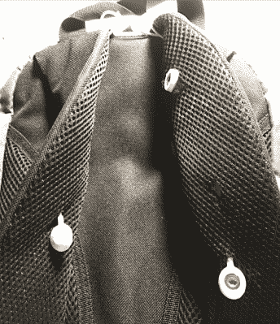

# 一个测量你心率的背包

> 原文：<https://hackaday.com/2020/05/11/a-backpack-that-measures-your-heart-rate/>

有趣的是，人们在便携式生物识别传感器上采用了不同的外形。我们看到心率监测器和其他生物传感器被集成到手表、耳塞、头带、运动胸衣以及各种其他服装和配件中。[Gabi]采取了一种有趣的方法，[将心电图(ECG)集成到背包中](https://www.instructables.com/id/Backpack-ECG/)。这种类型的[心率项目在 Hackaday](https://hackaday.com/2019/08/29/hands-on-cccamp2019-badge-is-a-sensor-playground-not-to-be-mistaken-for-a-watch/) 上非常受欢迎，所以在我们每天寻找新奇和令人兴奋的东西时，穿过【Gabi 的】设计是非常棒的。

[Gabi]使用了一个 Adafruit FLORA，一个 BLE 模块，一个来自 Bitalino 的 [ECG 传感器，一些其他辅助组件，当然，还有一个背包。我们很感激她向我们介绍了她遇到的一系列障碍以及她是如何绕过这些障碍的。很多时候，我们兴奋地分享我们的项目，我们删除了血淋淋的细节，只展示完成的项目，而实际上，我们从所有没有成功的事情中学到的东西比成功的事情更多。最后，[Gabi]讲述了复杂的穿线过程，以及将电路连接到 ECG 电极的卡扣连接器的具体位置。事情变得相当棘手，但幸运的是[Gabi]用图表、图片和对陷阱的早期通知非常细致地记录了她的项目。](https://plux.info/sensors/10-electrocardiography-ecg-sensor.html)

[Gabi]确保提醒她的读者这是一个原型，而不是医疗设备。她还提到了电气安全。心电图等生物识别设备需要包括一套严格的[隔离电路](https://hackaday.com/2009/09/18/usb-isolation/)，以防止对用户的潜在伤害。幸运的是，[有一些很好的方法](https://en.wikipedia.org/wiki/Galvanic_isolation)来实现这一点。

因此，感谢一个非常酷的项目，[Gabi]，以及我们的读者，为什么不享受一下我们的其他 ECG 项目呢？