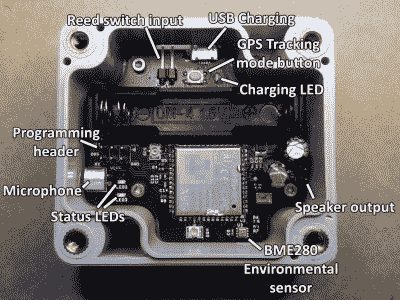

# 一种电池运输蜂窝邮箱通知器

> 原文：<https://hackaday.com/2020/01/22/a-battery-sipping-cellular-mailbox-notifier/>

像我们许多人一样，[扎克·肯布尔]在任何给定的时间都会收到无数来自世界各地的小包裹。不幸的是，他居住的地方的邮政服务有点不可预测，这意味着他发现自己要浪费很多时间去邮箱看看是否有海外的宝藏给他。为了解决这个问题，[他决定建立一个互联网连接的邮箱通知系统](https://blog.zakkemble.net/remote-mail-notifier-and-gps-tracker/)，它可以在一些相当具体的参数内工作。

一方面，邮箱太远，无法通过 WiFi 直接连接到它。[Zak]提到 433 MHz 可能是一个选项，但他决定完全跳过这个选项，只需用 A.I. Thinker 的 A9G GPRS/GSM 模块将其连接到蜂窝网络。这个设备实际上有自己的 SDK，允许你为它创建一个定制的固件，但不幸的是，无线电的高能耗意味着它会很快啃完电池，除非它有一点额外的帮助。

 不想每隔几个月就必须更换电池，[Zak]增加了一个 ATtiny402 来处理通知者的电源管理需求。通过使用 P-MOSFET 完全切断 A9G 的电源，通知程序可以节省大量的能源，只需在实际需要发送通知时激活蜂窝连接；在这种情况下，它采用 HTTP 请求的形式，最终工作到电报群聊。

长话短说，测试似乎表明，在需要对 10440 锂电池充电之前，通知程序可以发出大约 800 个请求。考虑到[扎克]通常接收邮件的频率，他说这应该够他用五年左右。

A9G 模块，ATtiny402，BME280 环境传感器(因为，为什么不呢？)、电池和所有辅助支持硬件都在外观非常专业的 PCB 上。这是一个相对坚固的外壳，旨在防止电子设备在邮箱的金属外壳上短路，以及防止任何特别重的包裹压碎它。

如果你有足够的自由在外面安装任何你想安装的东西，那么[你一定可以建造一个技术上更令人印象深刻的邮箱](https://hackaday.com/2016/05/14/building-a-sturdy-remote-control-mailbox/)。但是考虑到扎克不得不克服的局限性，我们认为他做得很出色。