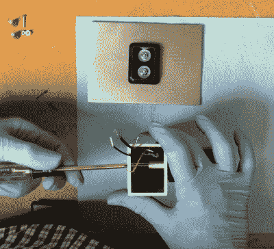

# 小规模生产的幕后故事

> 原文：<https://hackaday.com/2020/01/16/a-behind-the-scenes-look-at-small-scale-production/>

早在 2013 年，[Karl Lautman]就在 Kickstarter 上成功获得了他的运动雕塑 *Primer* 的资金。顾名思义，你按下设备前面的大红色按钮，顶部的机械计数器将点击一个新的质数，以获得观看乐趣。不完全是一个实用的小工具，但它看起来非常光滑。

 这些日子[你仍然可以从【卡尔】](http://karllautman.com/primer.html)那里得到你自己的入门知识，但是他告诉我们，销售并没有真正把食物放在桌子上。在这一点上，他认为这更像是一种自筹资金的爱好。为了说明如何创造这样一个美人，他制作了一个延时视频，展示了一个人是如何从开始到结束被建造的，你可以在休息后观看。

即使你对在家里增加一个数学设备不感兴趣，我们认为你也会同意，这个视频是对制造一个产品的努力的一个迷人的审视，这个产品只是稍微超过一次性的创造。

最大的收获是，你真的需要成为一个万事通来完成这样的事情。从研磨和抛光金属元件到手工放置 SMD 零件和回流电路板，[Karl]展示了当装配线上只有一个人时，你需要掌握的多学科知识。

小规模制造并不便宜，也不容易。但是像这样的故事证明，如果你愿意付出努力，这当然是可能的。

 [https://www.youtube.com/embed/hb_n-khN0FA?version=3&rel=1&showsearch=0&showinfo=1&iv_load_policy=1&fs=1&hl=en-US&autohide=2&wmode=transparent](https://www.youtube.com/embed/hb_n-khN0FA?version=3&rel=1&showsearch=0&showinfo=1&iv_load_policy=1&fs=1&hl=en-US&autohide=2&wmode=transparent)

