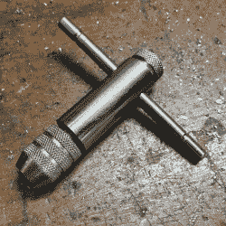

# 一点点自己动手做有助于剪断笔直快乐的线

> 原文：<https://hackaday.com/2020/09/12/a-bit-of-diy-helps-cut-straight-and-happy-threads/>

A cheap and effective ratcheting tap.

需要把线剪成一个洞？一种叫做*丝锥*的工具是你需要的，一种手动操作的工具，就像这边显示的一样，既经济又有效。丝锥的切割钻头通过进入预先钻好的孔来工作，在此过程中保持工具笔直是很重要的。用稳定的手和精确校准的眼球打几个孔是一回事，但当需要打大量的孔时，获得一点帮助是值得的。

帮助保持水龙头笔直并轻轻向下按压的常用工具被称为*水龙头从动件*，但是【托尼】有很多 M4 孔要打，没有时间订购一个并等待它到来。相反，[他把一个便宜的丝锥改造成一个工具，可以放在他的磨的卡盘上，根据需要自由上下滑动](http://funwithelectrons.blogspot.com/2020/08/linear-bearing-makes-quick-work-of-diy.html)。结果呢？手动操作的丝锥，但一定要垂直于工件，使切割大量螺纹的工作更加愉快。

敲击也不只是针对金属。在木头上切螺纹也是可以的，一定要[试试这个简单的方法，在商店里用螺杆或方头螺钉](https://hackaday.com/2017/07/24/simple-shop-made-taps-for-threading-wood/)制作你自己的惊人有效的木头丝锥。当然，可以通过使用合适材料的螺纹插件来避开[钻孔的需要。](https://hackaday.com/2019/12/12/are-you-getting-your-moneys-worth-from-threaded-inserts/)