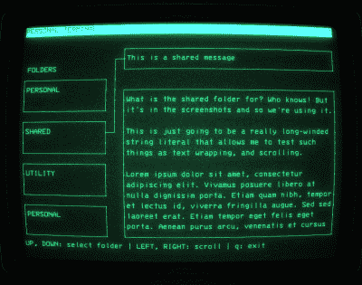

# 对你生命中异类的引导式问候

> 原文：<https://hackaday.com/2019/10/07/a-bootable-greeting-for-the-xenomorph-in-your-life/>

当他需要给他的*外星人*超级粉丝朋友买礼物时，【斯蒂芬·布伦南】决定使用他独特技能的最佳方式是创建一个可启动的 Linux 操作系统，它可以捕捉*诺斯托罗莫*复古未来主义计算机系统的[景象和声音。我们都需要这样的朋友。](https://brennan.io/2017/06/14/alien-computer-card/)

即使你从来没有想过给别人送一个可启动的闪存盘，这篇博文中也有大量关于 Linux 定制的信息，对各种项目都很有用。从创建一个启动图像到自动启动一个极简的窗口环境，这样一个单一的图形应用程序就占据了中心位置。

 无论你是想改造你的台式电脑还是想建一个树莓派(Raspberry Pi)信息亭，【Stephen】展示的命令和提示肯定会让那些对他们选择的 Linux 发行版“开箱即用”的外观不太满意的人感兴趣。

但是这个项目不仅仅是定制壁纸和一些复古字体。[Stephen]实际上花时间用 C 语言使用 ncurses 创建了一个“个人终端”计算机界面的复制品，该界面在最近的 *Alien: Isolation* 游戏中显示。由此产生的程序，[恰当地命名为“外星人控制台”](https://github.com/brenns10/alien-console)，在 BSD 许可下发布，足够灵活，你可以用它作为基础来构建你自己的赛博朋克 UI，或者只是[加载自定义文本文件并在你的 cyberdeck 上原样使用](https://hackaday.com/2019/09/20/3d-printed-virtuscope-is-a-raspberry-pi-4-cyberdeck-with-a-purpose/)。

最后，为了真正销售*外星人*的感觉，【斯蒂芬】仔细检查并从电影中提取了各种音频剪辑，并将其编入操作系统，这样它就能制作出适合电影的 boops 和 beeps。为了更好的沉浸其中，他甚至加入了诺斯托罗莫的引擎噪音音轨。但是也许我们最喜欢的技巧是使用`sleep`命令来人为地降低终端的速度，并给每样东西增加一点“重量”。毕竟，[驾驶一艘模拟的星际飞船应该是一件严肃的事情](https://hackaday.com/2014/09/13/an-rv-converted-into-a-spaceship-simulator/)。