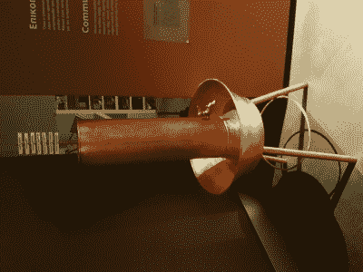
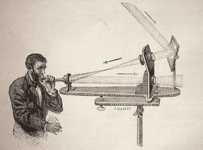
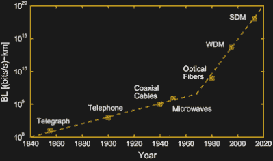
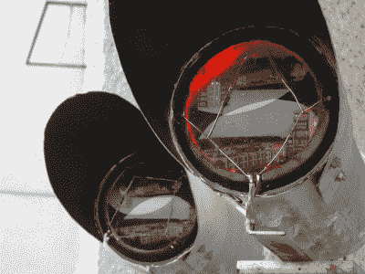
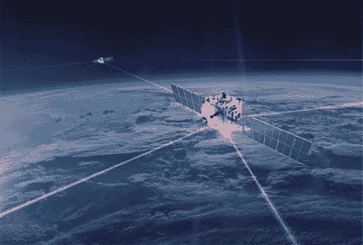

# 光通信简史

> 原文：<https://hackaday.com/2021/02/18/a-brief-history-of-optical-communication/>

我们生活在信息时代，上网被视为一项基本人权。行使这一权利在很大程度上依赖于光通信的技术进步。使用光来发送信息有着悠久的历史:从古希腊，通过克劳德·查普的信号塔和亚历山大·格雷厄姆·贝尔的光电话，到光纤网络和科技巨头目前开发的未来卫星互联网星座。

让我们更深入地探究一下历史上那些借助光传播信息的技术。

## 信号灯和日光仪

Reconstruction of a hydraulic telegraph at Thessaloniki Technology Museum. Credit: [Gts-tg](https://commons.wikimedia.org/wiki/File:Hydraulic_telegraph,_4th_century_BC_(reconstruction).jpg), CC BY-SA 4.0

因为光在空气中传播的距离比声音远得多，所以视觉通信一直是长距离传播信息的首选方法。最早的例子之一是古希腊的 Phryctoriae，这是一种建在山顶上的塔系统，可以通过点燃火炬来发送信息。据说，特洛伊陷落的消息就是这样传遍全国的。希腊人想出了不同的信息编码方法。一个是有两组五个火炬，每个火炬代表一个被称为[波利比乌斯广场的 5×5 希腊字母矩阵中的行和列。](https://en.wikipedia.org/wiki/Polybius_square)另一个是[液压电报](https://en.wikipedia.org/wiki/Hydraulic_telegraph)，它由一个装满水的容器和一根漂浮在其中的垂直杆组成。这根棒沿其高度刻有各种信息。当收到远程火炬信号时，容器中的水被慢慢排出，直到火炬再次熄灭。通过刻在杆上的位置，水位可以与特定的信息联系起来。

Semaphore towers and coding scheme devised by Claude Chappe. Credit: [Govind P. Agrawal](https://link.springer.com/chapter/10.1007/978-3-319-31903-2_8), Public Domain

18 世纪晚期，查普兄弟在法国设计并建立了一个信号塔网络，用于军事通信。每座塔的顶部都有一个旗语，由两根可移动的木臂通过横杆连接而成。通过调整每个臂和横杆的角度，总共可以显示 196 个符号，这些符号可以用望远镜从下一个塔上观察到。通过等待下行站复制符号，通信协议已经包括了一个 [ACK 信号](https://en.wikipedia.org/wiki/Acknowledgement_(data_networks))作为流量控制的手段。就数据速率而言，系统可以达到大约每分钟 2-3 个符号；一个符号从巴黎到里尔大约需要两分钟，经过 22 个站，230 公里。

在 19 世纪末和 20 世纪初，日光仪被广泛用于军事通信。它由一面镜子组成，可以旋转或用快门遮挡，以产生阳光闪烁，主要用于传输莫尔斯电码。尽管 heliograph 在 20 世纪 40 年代被大多数军队淘汰，但它仍然在 20 世纪 80 年代苏联入侵期间被阿富汗军队使用，并且仍然包含在许多紧急信号的救生包中。

## 贝尔最伟大的发明

Illustration of the transmitter part of the photophone. Credit: [Wikimedia Commons](https://commons.wikimedia.org/wiki/File:Photophone_transmitter_4074931746_9f996df841_b.jpg), Public Domain.

你们中的许多人可能知道那种 DIY 项目，其中通过激光束传输[音频信号，这种项目非常容易构建。这项发明可以追溯到亚历山大·格雷厄姆·贝尔，他在 1880 年发明了光电话，他认为这是他“有史以来最伟大的发明，比电话还伟大”。它可以使用安装在发音管末端的柔性镜子来调制反射阳光的强度，从而无线传输语音。接收器部分由位于抛物面镜焦点处的硒光电池组成。贝尔和他的助手泰恩特还利用涂有油烟的材料建造了非电接收器，从而发现了](https://hackaday.com/2012/08/31/a-laser-audio-transmitter/)[光声效应](https://en.wikipedia.org/wiki/Photoacoustic_effect)。尽管贝尔对自己的发明非常自豪，甚至想把他的第二个女儿命名为“光电话”，但这个设备从未真正合得来。这主要是因为几年后马可尼开创的无线电波传输远远超过了光所能达到的距离，而且不需要直接的视线。

## 引导光线穿过玻璃

Increase of the bandwidth-distance product throughout history. The squares mark the introduction of new technologies like wavelength-division multiplexing (WDM) and space-division multiplexing (SDM). Credit: [Govind P. Agrawal](https://link.springer.com/chapter/10.1007/978-3-319-31903-2_8)

除了一些军事项目，20 世纪的电信主要通过同轴电缆和相对较低频率 1-10 GHz 范围内的微波信号进行。直到 20 世纪 70 年代光纤通信的发展，低损耗光纤和半导体激光器的发明才成为可能。

通过同轴电缆进行高速通信的主要缺点是，信号必须每隔一公里重复一次，以弥补电缆损耗。对于无线射频(RF)通信，中继器间距可以大得多，但在这两种情况下，由于 RF 载波的“低”频率，带宽都被限制在约 100 Mbit/s。

可见光和红外光的频率约为 10 ^(14) Hz，远高于用于射频通信的 10 ⁹ Hz“千兆赫”频率。因此，就频率而言，光谱比*的整个*射频光谱宽约 2600 倍。这种更宽的带宽支持更高的数据速率。

光纤最早的应用之一是通过连接在导弹后部的光纤系绳控制短程导弹，该系绳在飞行过程中迅速展开。1977 年，通用电话和电子公司通过光纤系统以 6 Mbit/s 的速度发送了世界上第一个实时电话流量。今天，全世界的光纤网络估计跨越了 4 亿多公里，接近太阳距离的三倍。

光纤通信很快就远远超过了射频通信的传输速度，并通过复用技术得到了进一步的推动，如[波分复用](https://www.rp-photonics.com/wavelength_division_multiplexing.html)(在同一根光纤中发送多个波长)、[时分复用](https://www.rp-photonics.com/time_division_multiplexing.html)(根据信号的到达时间分离信号)或[空分复用](https://www.rp-photonics.com/space_division_multiplexing.html)(使用多芯或多模光纤)。使用这些技术的组合，[在实验室中已经演示了高达 11 Pbit/s 的数据速率](https://www.osapublishing.org/abstract.cfm?uri=OFC-2020-Th3H.1)。现代光缆中 0.2 dB/km 的低光损耗(即 1 km 后强度仅损失约 5%)可实现约 80 km 的中继器间距。

## 从你的灯泡上网

我们仍然主要使用射频频谱进行无线通信，但人们对无线光学又有了新的兴趣。在短距离内，这被称为 LiFi，并在大约 10 年前成为一个时髦的话题，部分是由这个 TED 演讲引发的。它宣传了使用现有的常规 LED 照明基础设施进行数据传输的想法。

一些优点是它更有效，更安全，不被窃听，并且允许更高的带宽。然而，让家里的 WiFi 通过你的灯泡传输的想法从未真正流行起来。可以说，其中一个原因可能是，依靠光线照射设备进行连接并不总是被认为是一种优势。到目前为止，LiFi 仅用于一些电磁干扰或安全性是重要问题的工业应用中。但是低带宽版本是黑客攻击的主要领域。

## 远行

长距离的光数据传输被称为自由空间光通信(FSO)。你可能还记得脸书的 Aquila 无人机计划，这是一个巨大的太阳能汽车，应该可以在平流层停留几个月，将互联网传输到偏远地区。除了空对地通信的标准 GHz 频段，他们还在试验自由空间光链路。这背后的技术仍然类似于贝尔的光电话，尽管我们现在使用红外激光而不是太阳光。在脸书于 2018 年取消其 Aquila 无人机计划后不久，由于技术困难，他们正在开发一个类似的系统，该系统使用卫星而不是无人机。2020 年 9 月，脸书的子公司 PointView Tech 发射了[雅典娜卫星](https://space.skyrocket.de/doc_sdat/athena_pointview.htm)，该卫星将测试激光地面链路。

谷歌(或者你更喜欢 Alphabet)正在从事类似的项目，叫做 [Loon](https://loon.com/) 和 [Taara](https://x.company/projects/taara/) 。玛雅·波什刚刚给[写了一篇关于潜龙](https://hackaday.com/2021/01/28/google-loons-internet-balloons-come-back-to-earth-after-a-decade-in-the-stratosphere/)的更详细的文章。它的目标是将高空气球网络送入平流层，为服务不足的地区提供互联网接入，但该项目在几周前被关闭。在 project Loon 中，两个相距 100 多公里的气球之间实现了 155 兆比特/秒的激光通信。Taraa 项目以这一成功为基础，旨在开发使用自由空间激光通信的塔，在 20 公里的距离内提供 20 千兆位/秒的连接。与安装光缆相比，这将是一种经济高效且可快速部署的方式，可为偏远地区带来高速连接。

Transmitter-receiver pair of the open-source project Ronja. Credit: [Twibright Labs](http://ronja.twibright.com/)

一家名为 [Koruza](http://www.koruza.net/) 的公司已经推出了类似的系统，传输速度高达 10 Gbit/s，尽管范围不大，只有 150 m。当然，[黑客也在玩弄这项技术](https://hackaday.com/2016/03/10/gigabit-ethernet-through-the-air/)。早在 2001 年，开源项目 [Ronja](http://ronja.twibright.com/) 提供了构建低成本发射器-接收器对的指令，能够在 1.4 公里的范围内进行 10 Mbit/s 的通信。作为一个发射器，它只是使用了一个标准的红色 LED，由放大镜回收的大透镜校准。Ronja 在大多数天气条件下都能工作，包括雨雪天气，但在雾天会失效。

Artist rendering of inter-satellite link via laser communication. Credit: [Mynaric](https://mynaric.com/)

这标志着 FSO 的一个主要缺点。虽然要求直接的视线使通信更安全，但它也施加了一些限制。多云的天气会使卫星与地面的通信中断，因此微波信号被认为在这种情况下更可行。然而，未来的互联网卫星星座，如 SpaceX 的 Starlink、OneWeb 或亚马逊的 Project Kuiper，很可能会使用激光通信作为卫星之间的安全、高带宽链接。开发这种硬件的最前沿是德国的 Tesat 和 T2 的 Mynaric。两家公司都提供激光系统，在低地球轨道卫星和地面站之间的数据速率高达 10 千兆位/秒。对于卫星间连接，Tesat 的激光系统可以在相距 80，000 公里的地球同步卫星之间实现 1.8 千兆位/秒，而 Mynaric 的激光通信产品在最远 8，000 公里的距离上实现 10 千兆位/秒。

光通信从古代的光通信到现代的激光通信的进步是由扩展人类互联性的目标所驱动的。从一开始，通信数据速率就增长了 12 个数量级，并在通过卫星网络提供全球宽带接入的太空竞赛中达到高潮。将互联网接入带到服务水平低下的地区当然是一个崇高的目标，但我们也可能会质疑，当它主要被视频流吞噬时，启用更高的带宽有什么意义。尽管光通信可达到的比特率没有严格的基本限制，但问一个问题也很有趣，那就是超越了什么，也许是中微子通信？