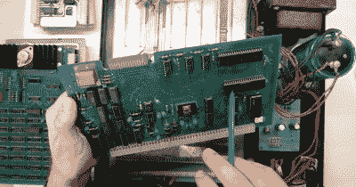

# 近距离观察一台鲜为人知的 8 位计算机

> 原文：<https://hackaday.com/2022/04/08/a-close-look-at-a-little-known-8-bit-computer/>

如果你读过个人电脑的历史，你会听到一些熟悉的名字，如微软、苹果，甚至 Commodore。但是有很多公司在当时很有名，也很受尊敬，但是今天已经被遗忘了。戈德布计算公司、俄亥俄州科学公司和西南技术产品公司(SWTP)。SWTP 最广为人知的可能是拥有相对便宜的打印机和“电视打字机”，但他们也制造了一台基于 6800 的计算机，而[Adrian] [带我们走进了其中。](https://www.youtube.com/watch?v=OsikuBXmJIo)

6800 是摩托罗拉进入微处理器领域，与英特尔 8080 竞争。在著名的 Altair 8800 推出后不到几个月，计算机就问世了。虽然 Altair 通常被认为是第一台业余爱好者级别的计算机，但也有一些基于 8008 的早期计算机，但 Altair 是第一台获得成功的计算机。

SWTP 以其空白的外观闻名于世。那时候大多数电脑都有很多开关和灯。SWTP 的正面是空白的，只有一个电源开关和一个复位按钮。一个 ROM 监视器让你用一个终端使用机器。与没有接口或内存的基本型 Altair 的价格差不多，你可以选择其中一个，并附带你需要的大部分额外功能。内存只有 2K，但这比你在那个价位买到的 Altair 多了 2K。

450 美元听起来相当便宜，但在 70 年代初，这是一个很大的草坪修剪。当然，当你需要给 Altair 增加内存时，你必须给 SWTP 增加某种终端。然而，您最终会得到更有用的东西，但是要得到一个正常工作的系统，总费用可能接近 1000 美元。

盒子里是一些老式的 PC 板和连接器，任何接触过 20 世纪 70 年代设备的人都会觉得很熟悉。行得通吗？我们还不知道，但我们希望如此。[阿德里安]承诺将在下一个视频。

我们在不到 50 年的时间里取得了惊人的进步。一个邮票大小的 10 美元的计算机现在有足够的速度和内存来同时模拟一堆这些旧机器。SWTP 在之前就已经在[我们的页面上了。许多这些旧机器和公司几乎都被遗忘了，但是](https://hackaday.com/2017/04/05/vcf-popular-electronics-and-southwest-technical-products-corporation/)[没有被我们遗忘！](https://hackaday.com/2020/01/30/ohio-scientific-300-trainer/)

 [https://www.youtube.com/embed/OsikuBXmJIo?version=3&rel=1&showsearch=0&showinfo=1&iv_load_policy=1&fs=1&hl=en-US&autohide=2&wmode=transparent](https://www.youtube.com/embed/OsikuBXmJIo?version=3&rel=1&showsearch=0&showinfo=1&iv_load_policy=1&fs=1&hl=en-US&autohide=2&wmode=transparent)

