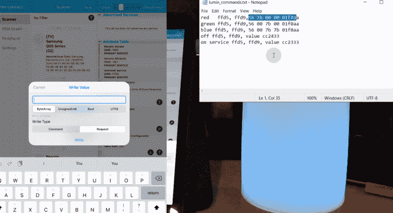

# 嗅探蓝牙低能量速成班

> 原文：<https://hackaday.com/2021/03/23/a-crash-course-on-sniffing-bluetooth-low-energy/>

如今，蓝牙低能耗(BLE)无处不在。如果你打开手机上的扫描仪，在附近走一圈，我们愿意打赌你会拿起几十个甚至几百个设备。推而广之，从健身带到灯泡，在某个时候，你也同样可能想要和这些 BLE 的小玩意说话。但是怎么做呢？

嗯，[看这个由[Stuart Patterson]](https://www.youtube.com/watch?v=JIh2YYwkzoE) 制作的三集视频系列将是一个好的开始。他讲述了如何获得配置为嗅探的廉价 nRF52480 BLE 加密狗，使用 Wireshark 从空中提取数据包，也许最重要的是，如何在 ESP32 上复制来自设备配套应用程序的命令。

Testing out the sniffed commands.

该系列的第一个视频专注于为 BLE 嗅探设置 Windows box，所以目前没有生活在微软靴子脚跟下的读者可能想跳到第二部分。这就是事情真正开始升温的地方，因为[Stuart]演示了如何拦截发送到目标设备的命令。

值得注意的是，很少尝试实际解码命令的含义。在这个特定的应用中，只需使用 ESP32 的 BLE 硬件重放命令就足够了，第三个视频对此进行了解释。很明显，这种技术可能无法在更高级的设备上工作，但是它仍然可以为您提供一个坚实的基础。

最后，[Stuart]用一个只能用智能手机应用程序控制的 LED 灯，把它变成了他可以用自己的方式说话的东西。一旦 ESP32 可以向灯发送命令，它[只需要多一点代码来启动 web 界面](https://hackaday.com/2020/01/27/esp32-serial-interface-modernizes-old-equipment/)或 REST API，这样你就可以从你的计算机或网络上的其他小工具控制设备。虽然很自然的细节会有所不同，但是同样的整体工作流程应该可以让你[控制任何你看中的 BLE 小发明。](https://hackaday.com/2020/01/20/teardown-bilbot-bluetooth-robot/)

 [https://www.youtube.com/embed/JIh2YYwkzoE?version=3&rel=1&showsearch=0&showinfo=1&iv_load_policy=1&fs=1&hl=en-US&autohide=2&wmode=transparent](https://www.youtube.com/embed/JIh2YYwkzoE?version=3&rel=1&showsearch=0&showinfo=1&iv_load_policy=1&fs=1&hl=en-US&autohide=2&wmode=transparent)

 [https://www.youtube.com/embed/_2RuJ5-pF5I?version=3&rel=1&showsearch=0&showinfo=1&iv_load_policy=1&fs=1&hl=en-US&autohide=2&wmode=transparent](https://www.youtube.com/embed/_2RuJ5-pF5I?version=3&rel=1&showsearch=0&showinfo=1&iv_load_policy=1&fs=1&hl=en-US&autohide=2&wmode=transparent)

 [https://www.youtube.com/embed/p6quFm5zmgU?version=3&rel=1&showsearch=0&showinfo=1&iv_load_policy=1&fs=1&hl=en-US&autohide=2&wmode=transparent](https://www.youtube.com/embed/p6quFm5zmgU?version=3&rel=1&showsearch=0&showinfo=1&iv_load_policy=1&fs=1&hl=en-US&autohide=2&wmode=transparent)

