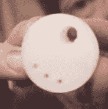

# 疯狂的波动自动机

> 原文：<https://hackaday.com/2022/05/08/a-crazy-wave-automaton/>

[Henk Rijckhaert]最近参加了一个“秘密圣诞老人”礼物交换活动。在《神秘圣诞老人》中，每个人的名字都放在一顶帽子里，每个人都必须看都不看就选一个名字。每个人都给他们抽到名字的人一份礼物。

亨克需要给艾米一个礼物，艾米是一个喜欢水和水上运动以及造物的朋友。所以他给她做了一个波浪机器人——海浪和鱼，并在这个视频中记录了制作过程。

建筑主要是胶合板和 3D 打印部件。我们不得不认为，在一个好的木材和黄铜将使爱好木材和金属工人可爱的项目重复它。

该项目的主体是 30 块胶合板，用垫片叠放在一起。每块电路板的一端都安装有一个 3D 打印的阶梯套管，该套管安装在一个水平插槽中。另一端是一个 3D 打印的偏心骑在一个超大(约 5 厘米)的洞里。所以板子在一端绕圈移动，在另一端来回移动，非常好地模拟了海浪。

这些偏心轮都装在一根公共轴上，但相位有所偏移。他有很好的设定阶段的技巧。每个偏心装置在以轴为中心的半径上有 3 个小孔。牙签进入其中两个孔，穿过下偏心轮的孔 2 和 3 以及上偏心轮的孔 1 和 2。3D 打印齿轮和手摇曲柄驱动系统。

海浪很有趣，但有点平淡。因此，他 3D 打印了一些扁平的鱼，将它们粘在黄铜棒上，并用环氧树脂将棒粘合到机械装置上。随着轴的转动，鱼会以弧形跳出水面。视频不清晰，但我们认为它们在小“槽”轴承上。

有几个有趣的构造细节。3D 打印齿轮通过压入六角孔的尼龙螺母将扭矩传递到轴上。手柄通过 3D 打印的六角头螺栓压配合来传递扭矩。环氧树脂让我们感到惊讶——黄铜棒似乎没有任何机械支撑。这可能是我们，因为视频是荷兰语，我们的荷兰语是有限的。

如果你喜欢这个构建，看看 3D 打印水滴机器人。

 [https://www.youtube.com/embed/Mx2BqVUP5SU?version=3&rel=1&showsearch=0&showinfo=1&iv_load_policy=1&fs=1&hl=en-US&autohide=2&wmode=transparent](https://www.youtube.com/embed/Mx2BqVUP5SU?version=3&rel=1&showsearch=0&showinfo=1&iv_load_policy=1&fs=1&hl=en-US&autohide=2&wmode=transparent)

