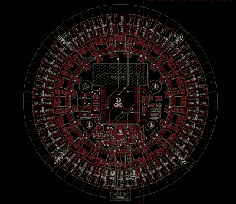

# 带 LED 灯丝指针的定制时钟

> 原文：<https://hackaday.com/2021/06/25/a-custom-clock-with-led-filament-hands/>

led 在我们的项目中已经变得无处不在，光是听到这个术语就可能会联想到一系列单一光谱颜色的微小发光圆顶的图像。人们很容易忘记这些高效的光源有多种形式，包括[比特伯克]用来制作[他漂亮的模拟 LED 挂钟](http://www.reddit.com/r/somethingimade/comments/nukioy/i_designed_made_a_clock_using_led_filaments)的复古灯丝。

除了美观之外，这款时计还有一些很棒的设计。定制的 PCB 充当所有 LED 灯丝辐条的集线器。板载大脑以 ESP32 的形式出现，这意味着它可以通过 NTP 保持极其准确的时间。 WS2811 LED 控制器为每根灯丝提供所需的 12 伏电压，使单独寻址变得轻而易举，我们已经习惯于在 RGB LEDs 旁边看到它们，以至于在这里看到它们几乎会感到陌生。

[bitborked]利用这种寻址能力来显示除标准钟面之外的其他动画。他们还计划为来自其他家庭自动化设备的最终警报实现 MQTT。当谈到只是告诉时间时，你可以通过亮度的差异来辨别单个“手”，遗憾的是，这在视频中不如在现实生活中显示得那么好。

我们当然很乐意将这个时钟挂在我们的墙上，我们希望最终能看到更多的 PCB 设计。不过，与此同时，我们可以对 LED 灯丝时钟的更数字化版本垂涎三尺。虽然，灯丝肯定不是使[成为一个漂亮的 LED 计时器](https://hackaday.com/2020/05/09/beautiful-free-form-led-clock-recreates-20-year-old-weekend-project/)所必需的。