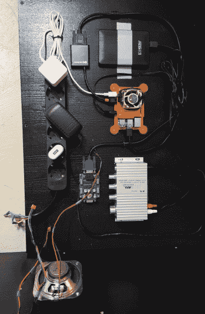

# 一个定制的树莓 Pi 4 街机柜

> 原文：<https://hackaday.com/2020/01/25/a-custom-raspberry-pi-4-arcade-cabinet/>

这些年来，我们已经介绍了相当多的基于 Raspberry Pi 的街机机柜，不可否认，它们中的许多都非常相似。毕竟，在它看起来不再像传统的街机之前，你只能做这么多变化。但即使如此，我们也不会厌倦看到[一个像【Dawid Zittrich】最近与我们分享的](http://home.yv3.io/diy-arcade-cabinet/)这样执行良好的构建。

 如今，你可以订购一个带有预切割面板的套件来建造橱柜，但想要完全定制，[Dawid]决定先在 SketchUp 中制作他的设计模型，然后自己用拼图来切割面板。这显然是相当多的工作，并假设你有足够的木工工具，但我们认为最终结果看起来很棒。更不用说它会比用 MDF 制成的东西坚固得多。

他还自己创作了侧面艺术作品，从他最喜欢的街机和 Amiga 游戏中选取了徽标和名称，并将其放在复古的渐变图案上。顶部的天棚有一个丙烯酸正面，用发光二极管从后面照亮。它安装在一个铰链上，这样它就可以被提起，一件新的艺术品就可以滑入，而不用拆开整个橱柜。虽然与我们已经看到的一些电子字幕相比，切换出来可能需要更多的劳动，但我们确实喜欢你仍然有能力心血来潮地改变作品。

随着橱柜本身的完成，[Dawid]将注意力转向了电子设备。在里面，你有前面提到的 Raspberry Pi 4(带有一个 Noctua 风扇以保持凉爽)，一个外部硬盘驱动器，一个 HDMI 到 VGA 转换器，带有扫描线生成器以驱动 4:3 比例的 Eizo Flex Scan S2100 监视器，以及一个相当强大的放大器挂在 Pi 的 3.5 毫米模拟音频输出上。所有这些都可以通过内置于机柜中的维护舱口轻松访问，因此[Dawid]在想要调整某些东西时不需要拆掉所有东西。

如果你想要那种拱廊橱柜的感觉，但没有空间和设备来把这样的东西放在一起，[你总是可以把一个树莓派粘在一个 iCade 上，然后就这样结束一天的工作](https://hackaday.com/2017/03/02/ipad-tossed-out-for-retropie-arcade-cabinet-redux/)。