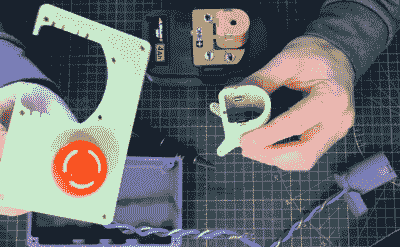

# 为近距离制作而设计的定制锯

> 原文：<https://hackaday.com/2020/04/29/a-custom-saw-designed-for-close-quarters-making/>

不用说，我们都希望有一个设备齐全的大车间。但在现实中，我们大多数人不得不面对少得多的东西。当试图将工具和设备放入一个小空间时，你需要发挥创造力，如果你能想出一种方法，将多种功能挤出来，那就更好了。

为了尽可能充分利用他的空间， [[Chris Chimienti]决定他最好的办法是设计和制作他自己的折叠组合桌](https://grabcad.com/library/sinister-saw-folding-combination-table-build-table-saw-router-table-mitre-saw-stand-table-components-1)。使用可互换的插件，它可以在台锯和刳刨机之间切换，并且通过其可延伸的臂，还可以作为他的斜切锯的支架。当然，当不切割时，它是一个方便的通用工作台面。

 在广告之后的视频中，【克里斯】带观众经历了他称之为“阴险的锯”的设计和构造，这一点由于他显然没有台锯而变得更加复杂。切割桌子本身的碎片和最终成为路由器和圆锯之家的面板需要用夹具和锯马进行一些仔细的工作，以确保它们都是完美的正方形。

但是邪恶锯的木制组件只是故事的一半。桌子可以通过铝挤压框架来扩展，并且有许多 3D 打印的零件,[Chris]已经提供了 STL 文件。我们特别喜欢这个盒子，它装有紧急停止按钮，并将工具的电池重新定位到前面板上，这看起来是他之前在 3D 打印无绳工具适配器方面的工作的[演变。我们可以肯定地看到，这部分是有用的其他项目，利用这些类型的电池。](https://hackaday.com/2020/03/30/designing-printed-adapters-for-power-tool-batteries/)

在另一个极端，当你想建造自己的工具并有足够的空间时，你可以尝试用巨大的石板制作一切。

 [https://www.youtube.com/embed/RstHCgREP1w?version=3&rel=1&showsearch=0&showinfo=1&iv_load_policy=1&fs=1&hl=en-US&autohide=2&wmode=transparent](https://www.youtube.com/embed/RstHCgREP1w?version=3&rel=1&showsearch=0&showinfo=1&iv_load_policy=1&fs=1&hl=en-US&autohide=2&wmode=transparent)

 [https://www.youtube.com/embed/cvWGXw-rk1U?version=3&rel=1&showsearch=0&showinfo=1&iv_load_policy=1&fs=1&hl=en-US&autohide=2&wmode=transparent](https://www.youtube.com/embed/cvWGXw-rk1U?version=3&rel=1&showsearch=0&showinfo=1&iv_load_policy=1&fs=1&hl=en-US&autohide=2&wmode=transparent)

