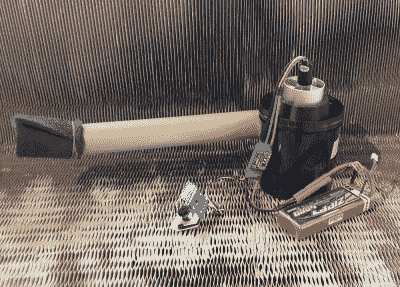

# 黑客预算的旋风吸尘器

> 原文：<https://hackaday.com/2019/05/17/a-cyclonic-vacuum-cleaner-on-a-hackers-budget/>

你有没有在商店里看到一件产品，并对制造商试图收取的价格感到震惊？既然你在读 Hackaday，我们可以有把握地假设这个问题的答案；以零售价格的一小部分制造某种商业产品的自制版本实际上是这些地区的通行仪式。因此，为了参加 2019 年的 Hackaday 奖，【Madaeon】提交了“DIY son”，这是一个由一家英国公司制造的流行高端吸尘器的开源版本，这家公司的名字你肯定能猜到。

 正如【Madaeon】在该项目的 Hackaday.io 页面上解释的那样，“气旋”真空背后的想法并不特别复杂。本质上，通过足够强大的鼓风机和精心设计的腔室，进入的空气将快速旋转，以至于灰尘被离心力带走。诀窍是让它在足够小的范围内工作，成为一个手持设备。特别是考虑到鼓风机马达的能量需求。

对现代黑客来说幸运的是，我们生活在 DIY 的“黄金时代”。有了 3D 打印机，你可以生产具有复杂几何形状的塑料部件，而且由于遥控飞机的复兴，大功率电机和高容量锂离子电池很容易获得。由电动管道风扇飞机的基本硬件驱动，DIYson 所有电子设备的总成本约为 60 美元。即使加上一卷打印机灯丝，你的价格仍然是“名牌”替代品的一半。

经过一些改进，[Madaeon]希望这种开源的除尘设备将成为全世界实验室和黑客空间的主要产品。从他的早期原型在休息后的视频中的表现来看，我们知道我们不会介意有一个。

 [https://www.youtube.com/embed/RmVtlc1-gls?version=3&rel=1&showsearch=0&showinfo=1&iv_load_policy=1&fs=1&hl=en-US&autohide=2&wmode=transparent](https://www.youtube.com/embed/RmVtlc1-gls?version=3&rel=1&showsearch=0&showinfo=1&iv_load_policy=1&fs=1&hl=en-US&autohide=2&wmode=transparent)

The [HackadayPrize2019](https://prize.supplyframe.com) is Sponsored by:     