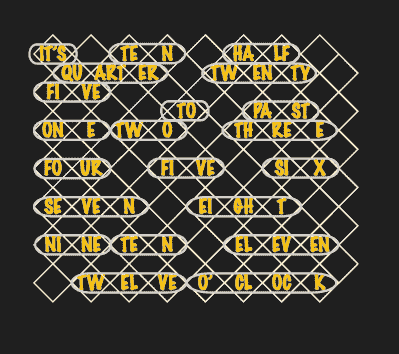

# 一种离散逻辑字时钟

> 原文：<https://hackaday.com/2021/03/12/a-discrete-logic-word-clock/>

自称计算机呆子的凯文·科斯特在完成他以前的设计之前就厌倦了设计新的 TTL 逻辑时钟。于是他终于静下心来，完成了[这个独一无二的字钟](http://computernerdkev.heliohost.org/wordclk/index.htm)，只用了屈指可数的几个 TTL 芯片。我们不能不同意他的朋友抱怨他们不能阅读[Kev]的笔迹，所以也许这个图表会使它更清楚。

除了是一个很好的纯逻辑项目之外，这将为年轻人提供一个例子，说明他们为今天实现起来如此简单的事情付出了多少努力。我们在项目页面上没有看到一张卡诺图，用来整理驱动分钟 led 的逻辑二极管。如果[Kev]像示意图上的老鼠窝二极管所暗示的那样，匆忙地做了这件事，我们不确定是应该责骂他还是应该被打动(他确实在另一张纸上非常整洁地重新绘制了这种逻辑)。

不用担心这个项目的高速布线。主振荡器从 50 Hz 交流变压器电源获得时间，并输出 16.7 mHz(非 mHz)的参考时钟信号，或每分钟一次。5 分钟计数器的分频频率为 3.3 mHz，小时计数器的分频频率为 277 uHz。如果你住在一个 60 赫兹电力网的国家，你必须修改振荡器部分。或者您可以在[Kev]的网站上联系他，因为他正在考虑在全球范围内提供这种套件。如果你喜欢单词钟，我们之前已经介绍过不少了，包括[这个非常复杂的背投时钟](https://hackaday.io/project/164612-servo-controlled-word-clock)。