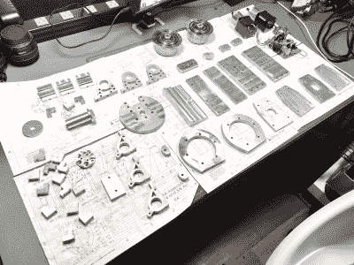

# 使用谐波传动的 DIY 赤道架

> 原文：<https://hackaday.com/2022/11/10/a-diy-equatorial-mount-using-harmonic-drives/>

正如一个业余天体摄影师会告诉你的，如果不花一大笔钱买一些像样的装备，你就无法捕捉到真正有趣的物体。撇开望远镜不谈，光是安装在 上的 *望远镜的复杂性、重量和相关成本就令人吃惊，更不用说能够进行任何可编程跟踪的望远镜了。[Alan(jiangliang)Zhao]显然想提升他们的游戏，在遭受了他们的天空观察者 5 pro 赤道坐骑的一些缺点后，决定继续前进，并[建立一个开源坐骑，](https://alanz.info/posts/2022/07/diy-mount/) Alkaid，希望对他们来说工作得更好一些。*

简而言之，拍摄一个极其昏暗、遥远的物体(或一个更大但扩散的物体)的困难在于，相机传感器需要花费大量的时间进行信号平均，以收集足够的光线通过噪声看到任何东西。但是，我们坐的这个岩石球在不停地旋转，所以唯一的解决办法就是追踪感兴趣的物体，进行补偿。这被称为赤道跟踪，并允许在长时间曝光期间补偿地球的旋转。

两个轴各自旋转的设计(抱歉！)围绕使用 NEMA-17 步进电机与 27:1 行星齿轮箱，驱动成谐波减速器齿轮箱。谐波传动(又名应变波传动)非常简洁，其工作原理是一个固定的、但呈圆形扭曲的环形齿轮，将扭矩从内表面传递到外部，几乎没有齿隙。它们是昂贵的零件，但对于超级平滑的运动来说，这就是你想要的。它们允许巨大的输出扭矩，这意味着[艾伦]能够在没有任何平衡力的情况下为重型望远镜安装支架。从结构上来说，整个建筑是由 10 毫米厚的铝板构成的，这些铝板用喷水器切割，随后进行打磨。

在电子方面，制作了一个定制 PCB，带有一对基于 TMC2130 的步进驱动器，由 teensy 4.0 控制。这个简单的设计是用 Eagle PCB 构建的，可以在[Alkaid project GitHub](https://github.com/alanzjl/AlkaidMount)上找到，还有框架的细节和合适的 [OnStep 望远镜控制器固件](http://www.stellarjourney.com/) 的副本。一些 3D 打印的侧面板将电子设备固定在适当的位置，并装入内部，使安装更加整洁。有点工业的样子。对于任何这样的挂载来说，一个重要的衡量标准是总重量，据[艾伦]报道，总重量约为 5.5 千克，不到 HEQ-5 挂载的一半，没有它的平衡力。希望它足够重，能够减弱从三脚架传来的任何振动，但测试将会证明这一点。

太复杂？没有足够的时间来建造？ [一个仓门跟踪坐骑](https://hackaday.com/2016/12/15/build-this-barn-door-tracker-today-take-stunning-shots-of-the-galaxy-tonight/) 怎么样？我们还看到了一款 [基于树莓派的追星软件](https://hackaday.com/2016/04/14/a-star-tracking-telescope-mount/) 作为 2016 年 Hackaday 奖的一部分。

 [https://www.youtube.com/embed/k2GoMa2DpH8?version=3&rel=1&showsearch=0&showinfo=1&iv_load_policy=1&fs=1&hl=en-US&autohide=2&wmode=transparent](https://www.youtube.com/embed/k2GoMa2DpH8?version=3&rel=1&showsearch=0&showinfo=1&iv_load_policy=1&fs=1&hl=en-US&autohide=2&wmode=transparent)

感谢[Buckarooooo]的提示！