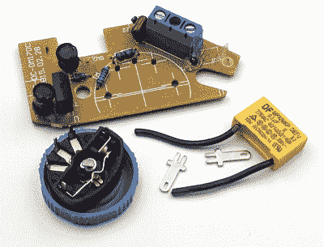

# 廉价旋转工具的嵌入式升级模块

> 原文：<https://hackaday.com/2019/07/22/a-drop-in-upgrade-module-for-cheap-rotary-tools/>

我们都见过它们，这些旋转工具看起来*几乎*，但不完全像 Dremel。它们的价格只是真货的一小部分，甚至使用与官方博世所有版本相同的零件。乍一看，对于那些试图在预算紧张的情况下装备他们的工作室的黑客来说，它们似乎是一个完美的解决方案。只有一个问题:两者之间的相似之处只是表面现象。

Recovering components from the original controller

正如[Vitaly Puzrin]解释的那样，这些克隆产品的一个大问题是电子设备过于简单，容易使电机在低转速时失速。因此，他为自己的特定 Dremel 克隆体开发了一种替代速度控制器，解决了这个问题。虽然模块设计可能不会在当前形式的每一个克隆体上对*起作用，但他相信在社区的帮助下，它可以适用于其他模型。*

当然，更换你的非 Dremel 中的速度控制器的第一步是移除那个粗糙的旧控制器。但是在你扔掉它之前，你需要恢复一些关键部件。特别是电位计、滤波电容器和电机端子。你可以从零件箱中找到后一种元件，但电位计很可能是为匹配工具而设计的，所以你至少需要这样。

微处理器控制的升级板使用反电动势来检测电机的当前速度，而不需要任何额外的传感器；这对像这样的改装模块很重要。[Vitaly]说，从概念上讲，这应该适用于任何交流有刷电机，如果你需要进行任何调整，固件的源代码是开放的。但黑客要注意，当前版本的 PCB 没有任何交流隔离；如果你想把它接到电脑的 USB 接口上，你需要特别小心。

另一方面，如果你愿意买一个便宜的旋转工具，只是为了打开它并更换电子设备，[你还不如自己造一个](https://hackaday.com/2017/11/22/roll-your-own-rotary-tool/)。如果你特别喜欢冒险，你总是可以[放弃电动马达，用一个小涡轮](https://hackaday.com/2019/02/28/vacuum-powered-rotary-tool-redux-this-time-machined/)让它旋转起来。

 [https://www.youtube.com/embed/6eNhbyeh3mg?version=3&rel=1&showsearch=0&showinfo=1&iv_load_policy=1&fs=1&hl=en-US&autohide=2&wmode=transparent](https://www.youtube.com/embed/6eNhbyeh3mg?version=3&rel=1&showsearch=0&showinfo=1&iv_load_policy=1&fs=1&hl=en-US&autohide=2&wmode=transparent)

The [HackadayPrize2019](https://prize.supplyframe.com) is Sponsored by:     