# 2019 年 Supercon 徽章展现了 FPGA 灵活性的奇妙前沿

> 原文：<https://hackaday.com/2019/11/29/a-fantastic-frontier-of-fpga-flexibility-found-in-the-2019-supercon-badge/>

我们刚刚结束了一次成功的 Hackaday 超级会议，会上许多人都在关注今年的硬件徽章。徽章的形状是 Game Boy 手持游戏机的一般形式，其核心是一个大型 FPGA，为徽章黑客攻击开辟了新的令人兴奋的潜力。

除了我们编译定制代码或用烙铁修改硬件的常规工具之外，我们现在还可以选择用 Verilog 来改变核心硬件的行为。人们探索这一新领域取得了巨大的成效，正如在徽章破解仪式上看到的那样。(视频嵌入下方。)

FPGAs 并不新鲜，[从技术上来说](https://hackaday.com/2019/11/20/old-cisco-wan-card-turned-fpga-playground/)，为什么它们现在令人兴奋？我们可以感谢他们最近的能力增长、快速下降的成本以及相对较新的开源工具链。这些发展将 FPGA 提升为当今最令人兴奋的硬件趋势之一，因此今年的徽章大师[Sprite_TM]为他的数百位最亲密的 Supercon 朋友建立了一个开放的 FPGA 游乐场。让我们来看看人们使用这种独特而强大的硬件在短短几天内能够完成什么。

## 提前开始:定制墨盒

一些乐趣甚至在超级周末之前就开始了。徽章开发是通过一个 [Hackaday.io 项目页面](https://hackaday.io/project/167255-2019-hackaday-superconference-badge)和用于[硬件](https://github.com/Spritetm/hadbadge2019_pcb)和[软件](https://github.com/Spritetm/hadbadge2019_fpgasoc)的公共 Github 库公开完成的。任何四处打探的人都知道会发生什么。比如每个徽章都配有一个[空白原型弹夹](https://github.com/Spritetm/hadbadge2019_protoboard)，内置闪存。在看到墨盒的设计后，像[ [Thomas Flummer](https://twitter.com/thomasflummer/status/1194017501895680003) ]这样的一些人决定在 Supercon 之前建造他们自己的定制墨盒。我们喜欢看到人们对他们尚未接触过的硬件的热情。

 [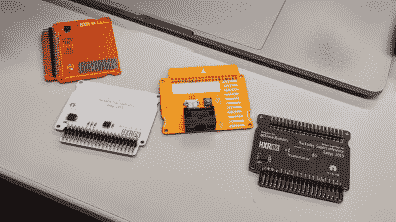](https://hackaday.com/badge-hacking-2019-01-flummer-cartridges/)  [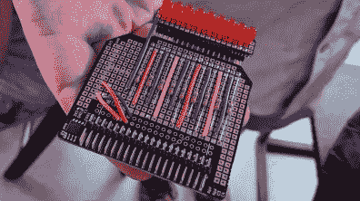](https://hackaday.com/badge-hacking-2019-02-charlieplex-led/)    [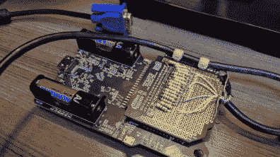](https://hackaday.com/badge-hacking-2019-04-vga-output/) 

其他人从空白墨盒的画布开始。从为 charlieplexing 整齐排列的 LED 阵列，到与任天堂控制器进行多人游戏的[[Ben Hencke](https://twitter.com/im889)]接口，到[Ste Kulov]的 VGA 视频输出电缆，等等。

## 美妙的单声道声音

 [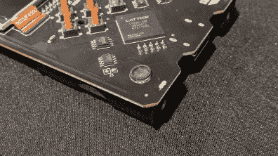](https://hackaday.com/badge-hacking-2019-05-tidy-little-speaker/)  [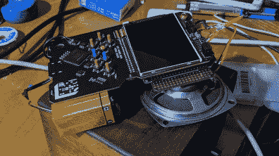](https://hackaday.com/badge-hacking-2019-06-amplified-big-speaker/) 

除了空白的墨盒，还分发了一个适中的小扬声器，焊接到音频放大器芯片上，钉在徽章前面。但消息很快传开，如果有人愿意暂时拆下一个电池托盘，就有可能从徽章的背面连接扬声器电线。这种简单而流行的方法导致了一个整洁的扬声器安装。其他人完全忽略了小扬声器，用更大的单元取代了它们，有些人像[ [艾米丽·维拉斯科](https://twitter.com/glowascii/status/1196127434598277121)]用额外的扩音支持他们的大扬声器。

## 他们用科学发光二极管和无线通讯弄瞎了我

 [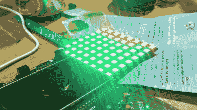](https://hackaday.com/badge-hacking-2019-07-ws2812-array/)  [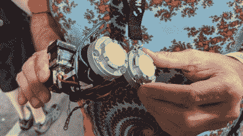](https://hackaday.com/badge-hacking-2019-08-may-cause-blindness/) 

为了全力支持那些只想闪烁 LED 的人，徽章上已经有几个了，人们可以从 C 代码或通过 Verilog 来闪烁它们。但是 perf 板可以轻松添加更多的 led，因此我们不缺少徽章照明。从托马斯·萨兰迪的彩色阵列到 T2 的破坏视网膜的装置。

 [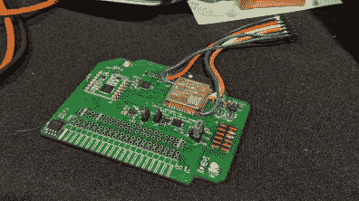](https://hackaday.com/badge-hacking-2019-09-odin-shield/)  [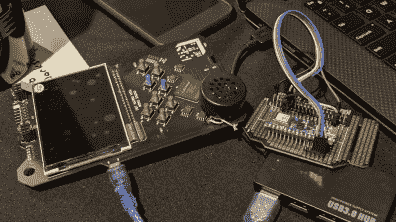](https://hackaday.com/badge-hacking-2019-09-spi-for-odin/) 

与“闪烁的 LED”相对的是[塞尔西翁]奥丁之盾团队，他们带着惊人的野心来到这里。他们的定制屏蔽不仅包含 ESP32-WROOM-32，还包含 RFM69HCW 亚 GHz 无线收发器和支持硬件。所有这些都是为了实现他们的目标，将徽章变成机器人的 FPV 控制台，并在屏幕上显示视频。

 [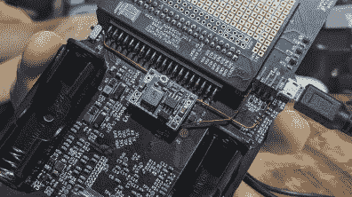](https://hackaday.com/badge-hacking-2019-10-usb-power/)  [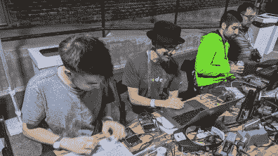](https://hackaday.com/badge-hacking-2019-11-quest-for-rgb-led/) 

但是人们不需要带自己的零件来迎接硬件挑战。[Sprite_TM]在徽章中嵌入了一个:微小的板载 led 实际上是 RGB 单元，但释放它们的全色需要钻研 schematics 和 Verilog。(带有需要回流的 LED [的徽章](https://twitter.com/im889/status/1196462210098221061)是一个偶然的大师级挑战，无论如何都要感谢[Ben]让它工作起来。)[ [伊恩·弗罗斯特](https://hackaday.io/ianjfrosst)是致力于解决 LED 挑战的几个人之一。但在烧坏了许多电池后，他做了一个生活质量黑客，添加了一个小型降压转换器模块，以一种不会损坏电池(如果有的话)的方式使用 USB 电源。

## 真正的选择你自己的硬件冒险活动

[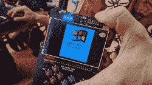](https://hackaday.com/badge-hacking-2019-12-windows-splash/)[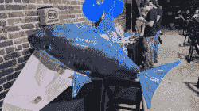](https://hackaday.com/badge-hacking-2019-15-shark/)[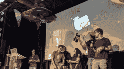](https://hackaday.com/badge-hacking-2019-16-shark/)

即使 RGB 挑战被故意忽略，徽章也为那些喜欢留在软件领域的人提供了大量现成的功能。我们钦佩[Caroline]，他在周末不知道 C 编程，但在结束时学到了足够的知识来创建一个丰富多彩的调色板动画演示。受游戏启发的闪屏动画鼓励其他人从其他领域创建闪屏。在徽章上看到一个旧的 Windows 启动屏幕很有趣。

 [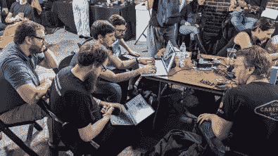](https://hackaday.com/badge-hacking-2019-13-linux-on-badge-team/)  [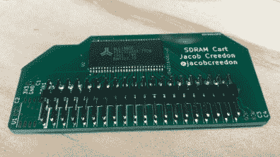](https://hackaday.com/badge-hacking-2019-14-sdram-cart/) 

最后，获得最大掌声的是 Linux-on-Badge:这个团队使用了书中所有的 Badge 黑客技巧。硬件组件是由[ [Jacob Creedon](https://hackaday.io/project/168591-hadbadge-2019-sdram-cartridge) 生产的 32 兆字节 SDRAM 盒式存储器。默认的 badge SOC FPGA 比特流被完全替换，以支持极简的 Linux。大部分开发工作是在[迈克尔·韦林]的电脑上完成的，这是由 LiteX 项目将 Linux 放在[radona ULX3S](https://radiona.org/ulx3s)上的先例所引导的。这是一个真正的 Supercon 合作成功的故事，因为团队(包括[Drew Fustini]、[Tim Ansell]、[Sean Cross]和许多其他人)走到一起，工作到深夜，从社区的大量集体专业知识中吸取经验。

## 这些 FPGA 徽章的下一步是什么？

徽章破解仪式可能结束了周末的活动，但我们希望这不是故事的结尾。许多人表示，他们打算在会议结束后继续玩徽章，项目范围从 3D 图形渲染到精密运动控制。这是一款比任何 FPGA 制造商的评估板都有趣得多的硬件，如果项目合作能在我们的[社区聊天频道](https://hackaday.io/messages/room/280647)上继续，我们会很高兴。这个徽章太好了，不能留在架子上积灰！

 [https://www.youtube.com/embed/3se_L0tRZeg?version=3&rel=1&showsearch=0&showinfo=1&iv_load_policy=1&fs=1&hl=en-US&autohide=2&wmode=transparent](https://www.youtube.com/embed/3se_L0tRZeg?version=3&rel=1&showsearch=0&showinfo=1&iv_load_policy=1&fs=1&hl=en-US&autohide=2&wmode=transparent)

