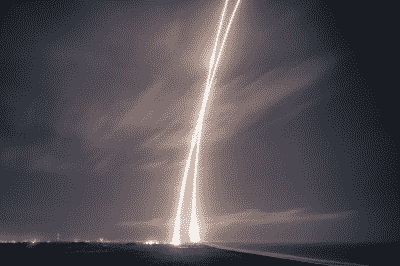
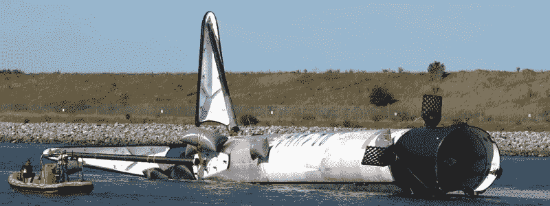

# 告别哈卡戴最喜欢的猎鹰 9 号助推器

> 原文：<https://hackaday.com/2020/02/25/a-farewell-to-hackadays-favorite-falcon-9-booster/>

除了航天飞机，火箭和宇宙飞船一直被认为是一次性的。这是一种缓慢而昂贵的旅行方式，类似于每次飞行都要建造一架新的客机，但这是最简单的选择。这些交通工具一直代表着他们那个时代工程和材料科学的顶峰，仅仅在太空旅行中幸存一次就是一个不可思议的成就。再来一次会对技术要求过高。即使回顾航天飞机项目，也有很多关于可重复使用的设计最终是否真的有回报的争论。

因此，SpaceX 能够着陆、翻新和重新飞行猎鹰 9 号助推器的第一级是一项不小的成就。在 2017 年证明这一想法是可能的后，该公司在考虑可重用性的情况下，对火箭的最新迭代进行了多次修改。这个版本的猎鹰 9 号被称为 Block 5，旨在提高生存能力，并在飞行之间需要最少的维护。该公司表示，重复使用 Block 5 比每次飞行都建造一个新的 Block 5 更便宜、更快，使该公司能够像商业航空一样进行航天飞行。

Falcon 9 launch and landing streaks. (Source: SpaceX)

随着一队 Block 5 助推器的轮换，SpaceX 给了它们序列号，就像飞机的尾号一样。这可能不是一般公众通常会知道的事情，但这些序列号使一个专门的太空爱好者社区能够跟踪每个助推器的飞行任务。

不幸的是，这些火箭之一的故事，在 SpaceX 的说法中被正式称为“核心”，最近被缩短了。Core B1056，2 月 17 日从 Starlink 4 任务返回，未能降落在自主太空港无人机舰(ASDS) *我当然还爱* *你*溅落在海洋里。目前还不清楚助推器在水中软着陆后的状况，但当回收船空手返回港口时，B1056 的命运毫无疑问。

从纯粹的商业角度来看，SpaceX 任何一个助推器的失败都意味着时间和收入的损失。但在某些方面，B1056 已经确立了自己作为舰队先锋的地位，在其相对短暂的生命中，成功地创造或打破了多项记录。经过最彻底的飞行验证的 Block 5 助推器的破坏是一个严峻的提醒，太空飞行很少可以被称为例行公事。

## 有点名气的支持者

当谈到由可重复使用的助推火箭创造的记录时，无可否认没有太多的竞争。随着更多的“新太空”公司将他们的可重复使用的飞行器上线，这种情况应该会在未来几年发生变化，但就目前而言，SpaceX 本质上是在与自己赛跑。尽管如此，B1056 和它的同类产品相比还是很有意思的。

首先，它是第一个被无意摧毁的重复使用的 Block 5 助推器。虽然这不是第一次拙劣的着陆:core B1050 在海岸返回卡纳维拉尔角时遭遇控制故障，不得不被拖入港中。当着陆被认为不切实际时，之前的几个核心被允许坠入海洋，而[核心 B1046 被牺牲用于 Crew Dragon 的戏剧性飞行中止测试](https://hackaday.com/2020/01/16/a-spacex-falcon-9-will-blow-up-very-soon-and-thats-ok/)。

Towing the heavily damaged B1050 back to port on [December 7th, 2018](https://www.youtube.com/watch?v=aVXJhrUyuTA).

从更积极的方面来看，B1056 目前保持着从着陆到返航最快的记录，准确地说是两个月。这仅仅比航天飞机历史上最快的一次周转多了几天，而且预计这个过程只会越来越快。在过去，SpaceX 声称他们的目标是 Block 5 的 24 小时周转时间，尽管许多人认为两周是一个更合理的目标。

Core B1056 也是第一个向国际空间站发射两次商业再补给服务(CRS)任务的 Block 5 助推器。该助推器在 CRS-17 任务中首次亮相，几个月后又发射了 CRS-18。美国宇航局允许 SpaceX 在关键的国际空间站补给任务中使用以前飞行过的助推器是一个巨大的里程碑，表明这个历史悠久的航空航天局认识到猎鹰 9 号的重复使用已经从实验过渡到操作能力。

## 未来的状况

当然，对我们这些旁观者来说，所有这些成就都不过是纸上的数字。即使是 SpaceX 最忠诚的追随者也不会仅仅因为它比同行执行了更多的国际空间站任务，或者是(到目前为止)最快通过飞行后检查的，就觉得与某个核心有任何特殊的亲缘关系。但是在这种特殊的情况下，黑客社区可以声称对可重复使用的火箭的熟悉程度略高于平均水平。

2019 年 5 月 4 日的 CRS-17 任务不仅仅是 B1056 的首飞；这也是第一次 [Hackaday 现场记录火箭发射](https://hackaday.com/2019/05/28/there-and-back-again-a-falcon-9-launch-story/)。不是我们计划的那样。事实上，我们在正确的时间和地点不仅看到了助推器黎明前的发射，而且看到了它第二天早上胜利返回卡纳维拉尔港，这完全是一个巧合。亲眼所见令人肃然起敬，从我们收到的对文章和视频的回应来看，即使是亲身经历，也有类似的效果。

普通的黑客读者无疑已经注意到这些年来我们的范围在逐渐扩大。虽然硬件黑客和工程将永远是这个社区的核心，但我们不可能忽视我们许多人共享的一些重叠利益。[2019 年，我们点击率最高的几篇文章都是关于火箭技术和太空探索的](https://hackaday.com/2019/12/27/2019-as-the-hardware-world-turns/)，为什么不应该呢？很难想象一个比使用激烈的化学反应让一个满载传感器的机器人在太空中飞行数亿公里更极端的工程例子。

在描述了 core B1056 的第一次发射和着陆之后，我以我的信念结束了上一篇文章，我认为我刚刚看到的是对未来的一瞥。尽管不到一年后失去了同一辆车，那种热情的感觉仍然明显。让人类更容易进入太空的梦想不仅仅局限于一枚火箭或一项任务。这是一个工程师们从太空时代开始就一直在追逐的想法，现在他们离放弃已经很近了。

 [https://www.youtube.com/embed/XcT4SJYMgw0?version=3&rel=1&showsearch=0&showinfo=1&iv_load_policy=1&fs=1&hl=en-US&autohide=2&wmode=transparent](https://www.youtube.com/embed/XcT4SJYMgw0?version=3&rel=1&showsearch=0&showinfo=1&iv_load_policy=1&fs=1&hl=en-US&autohide=2&wmode=transparent)

