# 我最喜欢的几样东西:钢笔

> 原文：<https://hackaday.com/2021/03/29/a-few-of-my-favorite-things-pens/>

钢笔！它们可能是最便宜、最重要的技术，却被一大群人每天忽略了。从你的桌子到你的汽车到你的垃圾抽屉，笔无处不在，尽管当你需要一支笔时，它们往往会突然消失。没有他们我们会怎样？可能还在用蒲公英和甜菜在洞壁上画画。

[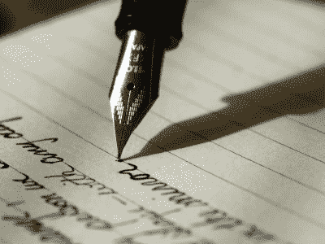](https://hackaday.com/wp-content/uploads/2021/03/unsplash-fountain-pen.jpg)

Photo of a Pilot Metropolitan by [Aaron Burden](https://unsplash.com/@aaronburden?utm_source=unsplash&utm_medium=referral&utm_content=creditCopyText) on [Unsplash](/s/photos/fountain-pen?utm_source=unsplash&utm_medium=referral&utm_content=creditCopyText)

为什么我觉得钢笔这么伟大？嗯，它们是相对便宜的工具，取决于你得到的笔，但是无论你花多少钱，你都物有所值。笔是可能的，纯粹而简单，它们甚至可以方便地包装在一个便携式设备中。

从美学角度来说，我喜欢钢笔，因为它们的里里外外都有很大的不同。它们中的一些制造粗线，一些制造细线，在柔性笔尖的情况下，一些根据压力在粗线和细线之间交替。我使用钢笔有很多原因，最主要的是为了写作。你在这里读到的所有以我的名字命名的东西都是从纸上的笔痕开始的。

笔是革命性的，因为它们可以用来使想法永久和/或说明任何概念。明智地使用这支笔取决于你。你可以在以后使用其他更好的工具，但是钢笔总是第一个很好的工具。如果你没有被不舒服的握法、跳跃的墨水或粗糙、拖拉的接触点所阻碍，你的想法会更加自由地流动。当你找到适合自己的笔时，你不会被你的工具所阻碍——你会被它提升。

[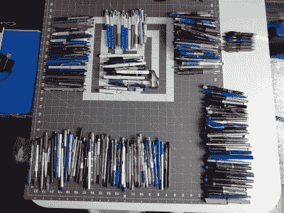](https://hackaday.com/2021/03/29/a-few-of-my-favorite-things-pens/collection/)

A handful of the more interesting pens from my collection.

[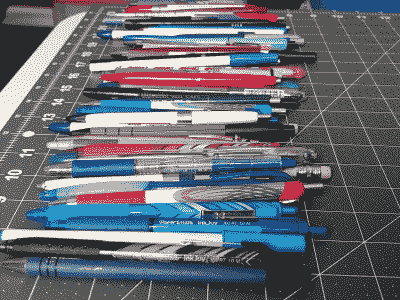](https://hackaday.com/2021/03/29/a-few-of-my-favorite-things-pens/ballpoints/)

Ballpoints

[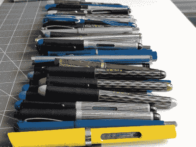](https://hackaday.com/2021/03/29/a-few-of-my-favorite-things-pens/fountains-2/)

Fountains

[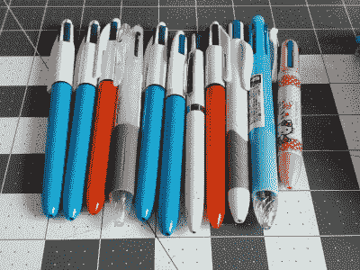](https://hackaday.com/2021/03/29/a-few-of-my-favorite-things-pens/multis/)

Multis

[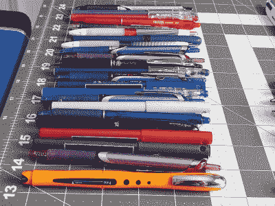](https://hackaday.com/2021/03/29/a-few-of-my-favorite-things-pens/rollerballs-2/)

Rollerballs

[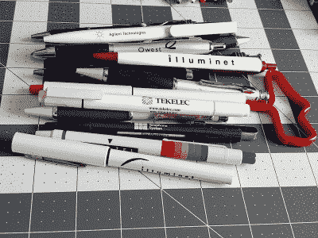](https://hackaday.com/2021/03/29/a-few-of-my-favorite-things-pens/telecom/)

Pens from a previous life

## 这台机器杀死法西斯分子

在玛格丽特·阿特伍德(Margaret Atwood)的《女仆的故事》的恐怖科幻未来中，唯一被允许读写的女性是阿姨们——高级别的女性，她们训练女仆，并对任何获得这种待遇的人进行惩罚，无论等级高低。基列共和国的所有标志和包装都被简化为表意文字，以防止女仆、妻子和小女孩阅读任何文字——以免他们被赋予组织和改变命运的权力。在这个鬼地方看书或写字被抓，你会失去一只手。

大多数人认为理所当然的书写工具中固有的真正的自由。你可以自由地写任何你想写的东西，尽管你可能想事后烧掉它。当然，自由是在人性的更大结构和人类可能的范围内，但是笔把我们推向可能性和未来。最重要的是，笔帮助我们思考。他们是产生艺术作品的艺术作品。我曾经找到一支铅笔，上面写着[伍迪·格思里的宣言](https://en.wikipedia.org/wiki/This_machine_kills_fascists)‘这台机器杀死了法西斯分子’。我希望它是一支笔，因为铅笔的痕迹很容易被法西斯分子擦掉。

笔帮助我们交流思想，探索我们的思想。它们是全面洞察的工具。打字可能更快，但是手写给我们更多的时间来形成我们要说的内容。无论你去哪里，带着笔和纸比带着笔记本电脑或打字机要容易得多。只要你有墨水和基底，你就可以捕捉任何想法，不需要电池。这就是自由。

[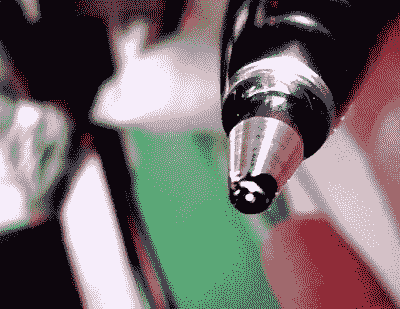](https://hackaday.com/wp-content/uploads/2021/03/blobby.jpg)

My daily driver G-2 is all blobby again even though I wiped the tip an hour ago.

## 钢笔心理学

如果我觉得卡住了或者没有主意了，有时候我要做的就是换支笔。当我需要一个新的思维模式时，或者如果我想给一些东西标上颜色，我也会换笔。

直到最近，我几乎每天都会更换我的钢笔颜色，但几个月前我被这支 0.7 毫米的黑色 Pilot G-2 卡住了。出于某种原因，我只是进入了那支笔的流动状态，尽管它们总是在笔尖上变得模糊不清，没有必要去对抗让我进入流动状态的东西。

我想尝试大胆的(1.0 毫米)，我做到了，现在*这些*是我的正式果酱，直到另行通知。我肯定我会在某个时候回到使用彩虹笔的状态，或者至少得到更多颜色的加粗 G-2。

## 凝胶会膨胀

[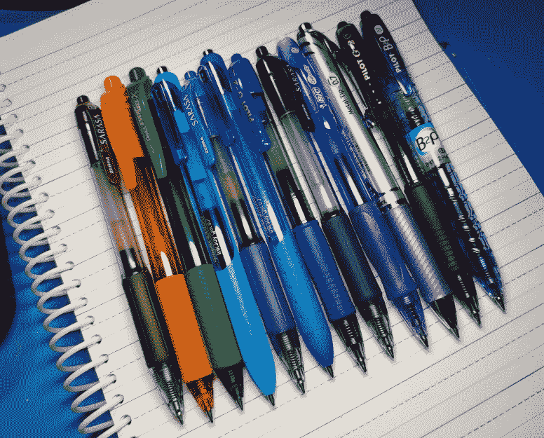](https://hackaday.com/wp-content/uploads/2021/03/gels-2-cropped.jpg)

My current crop of favorite gels. L-R: old Zebra Sarasa, orange and green Pentel Energel Xs, Paper♥Mate InkJoy gel, another old Zebra, Pilot G-2 bold, old Zebra #3, Bic Gelocity, Pentel Energel Needle Tip, another G-2 bold, and a Pilot B2P which is just a G-2 in a body that’s made from recycled plastic bottles.

[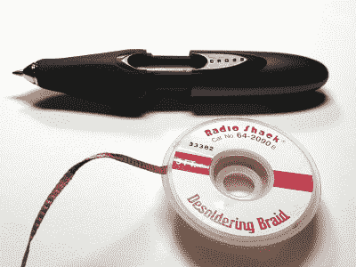](https://hackaday.com/wp-content/uploads/2021/03/pocket-cross-gel.jpg)

My pocket Cross pen.

我不得不说，就日常使用而言，中性笔无疑是我最喜欢的笔。中性笔出现在 20 世纪 80 年代中期，并在 80 年代末风靡美国，我记得它们取代了圆珠笔，成为年轻的书呆子中最热门的东西。在我的小学里，任何一个有名气的人都有四种颜色的精密滚动圆珠笔，但是只有那些超级酷的孩子才有 Gelly 滚动笔。

当我写作时，我有紧张和用力过猛的倾向，这来自于学习用铅笔和圆珠笔写字。由凝胶制成的深色、自由流动、易于使用的标记帮助我后退，这样我可以写更长时间而不会疲劳。

我喜欢凝胶，因为在大多数情况下，它们随时可以书写，而且不会像圆珠笔那样容易晕过去。我经历过使用滚珠笔或自来水笔的阶段，但我总是会回到凝胶上。它们很容易携带，尤其是我已经用了大约二十年的袖珍十字笔。是不是很可爱？你只需拉开它打开它，扭转它更换墨盒，再推回一起关闭它。

## 快乐的源泉

[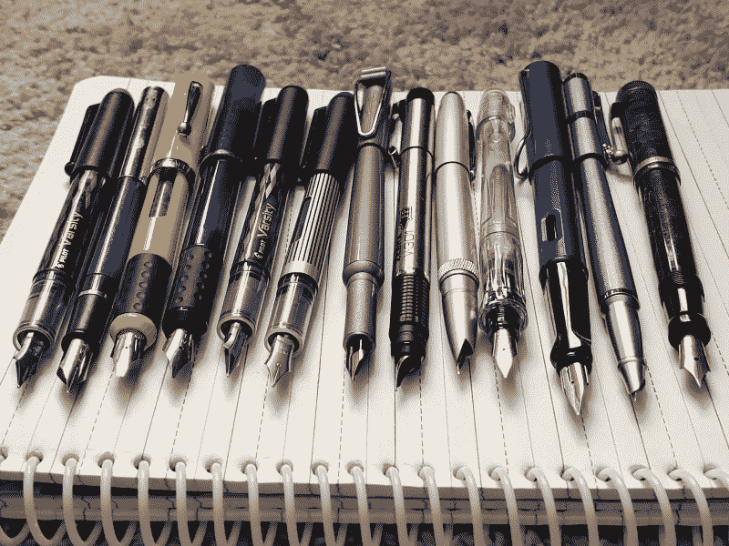](https://hackaday.com/wp-content/uploads/2021/03/fountains.jpg)

L-R: Pilot Varsity, Sheaffer with missing clip, bold Sheaffer, medium Sheaffer, Pilot Varsity, old-style Pilot Varsity, Pentech Sabre (a cheap refillable Walgreens pen from 20 years ago), Zebra V-301, Jinhao (from ebay), Pilot Something or Other, that dreadful Lamy Safari, another hooded nib ebay special, and an old Parker Duofold Jr.

我真的很喜欢用自来水笔，尽管我不得不用它们写得更慢。我会专门用我的一个喷泉进进出出，直到我厌倦了整天打开和盖上它，然后我会回到凝胶。市面上有几种可伸缩的自来水笔，但它们都很贵(80 多美元)。

在很大程度上，相对于昂贵的喷泉，我更喜欢便宜和中档的喷泉，但迄今为止我只有一个昂贵的喷泉，而且我不喜欢它:拉米野生动物园。我认为问题是我没有带自己的纸去高档的钢笔商店，现在我会把它推荐给任何人。他们有纸，当然，但它总是花式纸，而不是像你在螺旋，法律垫，或作文书里找到的日常用纸。此外，看看他们是否会让你坐下来试笔，而不是趴在玻璃盒上，因为坐着和站着也有区别。

[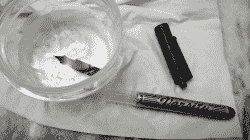](https://hackaday.com/wp-content/uploads/2021/03/refill-varsity.jpg) 有一种叫 Pilot Varsity 的一次性自来水笔，我已经用了大约二十年。它们是一次性的，从某种意义上说，你不容易重新装满它们，除非你专心致志，精明能干，并愿意在某个时候变得有点模糊。我自己用[这种方法](https://fountainpenlove.com/how-to/refill-pilot-varsity-disposable-fountain-pen/)做过，用一把尼龙珠宝钳移除和重新安装笔尖非常容易。

Varsities 非常适合日常使用，只是携带起来有点吓人。如果它被打开并遇到任何可以吸走墨水的东西，那将是一个糟糕的时刻。但是它们有大量的墨水，即使我几个月甚至几年没碰过它们，它们也能马上工作。真的。

## 写花式字母的花式笔

[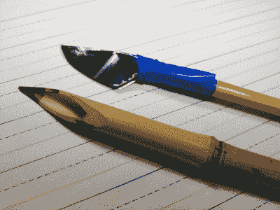](https://hackaday.com/2021/03/29/a-few-of-my-favorite-things-pens/bamboo-and-shiv/)[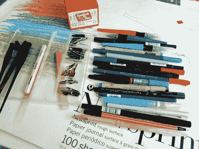](https://hackaday.com/2021/03/29/a-few-of-my-favorite-things-pens/calligraphy-pens/)[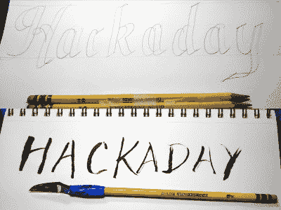](https://hackaday.com/2021/03/29/a-few-of-my-favorite-things-pens/double-pencils-and-shiv-pen/)[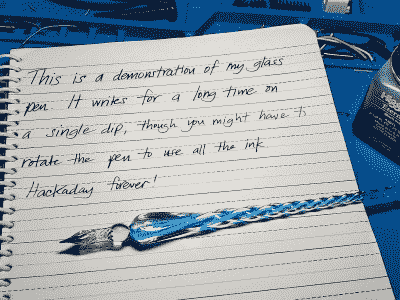](https://hackaday.com/2021/03/29/a-few-of-my-favorite-things-pens/glass-pen/)

我很早就被字体设计和书法所吸引，有时会把两者混为一谈，所以我有各种各样的书法标记笔、笔尖座、笔尖和毛笔。

其中比较奇怪的是几支蘸笔，它们只是巧妙雕刻的竹条。我还有两支并排贴在一起的铅笔，当它们呈 45 度角时会产生书法字母。我甚至有一支自己做的笔，看起来像一把用雪碧罐做成的小监狱刀，它被粘在一只从未削尖的铅笔上。恐惧是一种意义——你只要把它浸在墨水里，它就能容纳几个词，像电影里的字母一样。今年我得到了一支可爱的玻璃笔作为周年纪念。这是一支蘸笔，但是螺旋墨水供应器能容纳比你想象的更多的墨水。

## 我对圆珠笔的不满

[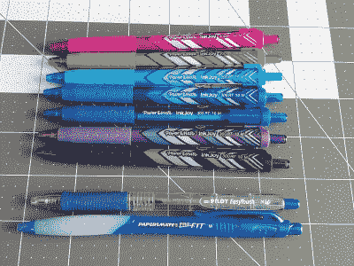](https://hackaday.com/wp-content/uploads/2021/03/inkjoys-et-al.jpg)

There are a few kinds of ballpoints that aren’t so bad.

我不喜欢圆珠笔。好吧，这不公平。理论上我非常喜欢圆珠笔——它们粘稠的油基墨水不会像凝胶墨水或水基墨水那样很快用完，它们可以制作出漂亮的艺术品，最重要的是，它们代表了墨水动力书写工具变得便宜和便携的时代[。但它们不适合我。](https://hackaday.com/2020/12/17/tech-hidden-in-plain-sight-the-ballpoint-pen/)

我希望我喜欢标志性的、无处不在的日常圆珠笔，比如 Bic Cristal 或普通的圆形 Stic。我写字的时候会很用力，尽管我尽量不这样做，圆珠笔通常会让我更用力，这让我的手和手腕更快疼痛。我不能也不会在大多数情况下使用圆珠笔，除非它们用起来真的很光滑，而且会留下黑色的痕迹。

我很喜欢 Paper♥Mate InkJoys，并希望其他圆珠笔制造商努力使他们的大胆和顺利。偶尔，出于某种原因，我会找到一支写得非常好的促销笔。99%的时候这些都是圆珠笔，而且几乎都是黑色的。我希望我喜欢圆珠笔，这样我就可以享受使用我收藏的几十年前的四色钢笔。我有 4 色的 InkJoy，与普通的单色 ink joy 相比，其输出真的令人失望。

## 用墨水思考

[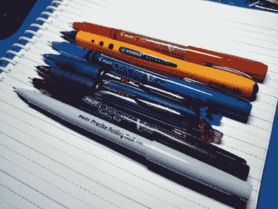](https://hackaday.com/wp-content/uploads/2021/03/rollerballs-2.jpg)

Top to bottom: vintage Pilot Precise V5, Stabilo Worker, another vintage Precise but V7, two modern retractable Pilot Precise, super-vintage Pilot Precise V5, and a Pilot Precise Rolling Ball that may predate them all.

我真的很享受手写的过程，使用合适的笔可以让我的输出和思路产生巨大的变化。无论你想做什么，一支好的、舒适的笔都是一个很好的开始和流动的方式，尤其是如果你需要先把一堆想法整理好。你最喜欢用什么工具来捕捉和充实你的想法？请在评论中告诉我们！