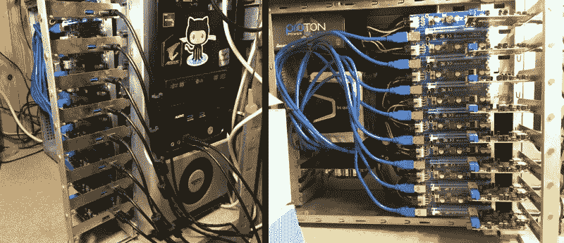

# 一群黑客制造宽带 sdr

> 原文：<https://hackaday.com/2022/04/01/a-gang-of-hackrfs-makes-for-a-wideband-sdr/>

[奥列格·库特科夫]决定[建造一个宽带 SDR](https://olegkutkov.me/2021/11/29/hackrf-supercluster/)——用于卫星通信研究和监测，你知道，通常情况下。他决定使用一组 HackRF 板，实际上是全部八块。两个 1×4 和一个 1×2 RF 分配器以及它们的组合 RF 输入上的一个 LNA 为该项目创造了一个良好的开端，从那以后，它只会变得更加复杂。

HackRF 板可以与单独的时钟源同步，但在星型配置中，你不能只将一条时钟线连接到所有的时钟源。因此，他构建了[一个时钟分配和放大器板](https://olegkutkov.me/2021/04/10/1pps-square-clock-8-channel-distribution-amplifier/)，1 PPS 时的传播延迟为 4 ns，10 MHz 时的延迟仅为 10 ns。然后，他[将那块板与 HackRF 设置](https://olegkutkov.me/2021/08/19/housing-for-the-1pps-square-clock-8-channel-distribution-amplifier/)集成在一起，添加了一个外壳，连接了一根特制的电缆，并处理了出现的反射。

HackRF 板是 USB 2.0，能够生成高达 320 MB/s 的数据流，并且没有可行的方法将八个 2.0 链路聚合成一个 T1。为了解决这个问题，他使用了八个独立的 PCI-E 到 USB 3.0 卡，每个卡都插有一个 HackRF，所有卡都通过我们通常看到的用于采矿目的的 PCI-E riser 连接到 AMD 锐龙 9-powered PC。为了将这一切联系在一起，他创建了一个 gnuradio 流程图，并修补了 osmocom 源代码块，以启用他决定使用的外部时钟同步机制。

Each HackRF is connected to its own PCIe USB card.

最后，[Oleg]向我们展示了一些有希望的结果——在频谱捕获的瀑布图中可以看到两个 DVB-S 收发器。明确地说，这里的工作还没有结束——他遇到了一些障碍。gnuradio 流程图不太适合多线程，即使在锐龙 9 机器上也是如此，[Oleg]承诺用 C++重写捕获机制，可以很好地分配给独立的物理 CPU 内核，这显然是 gnuradio 不太擅长的。

更重要的是，捕捉到的频谱不是连续的，[Oleg]质疑是否能正确解调。由于上采样，他不得不求助于频率重叠，他不太确定如何补偿这一点。整体频率稳定性也是一个问题。然而，从这里看，构建宽带接收机的大部分工作似乎已经完成！

[Oleg]通常出现在 Twitter 上，最近对 Starlink 做了一些重大调整——因为他目前所在的城市基辅正在遭受俄罗斯武装部队的轰炸。我们只能尊重和欣赏这种奉献。今年 1 月，我们报道了他在[上的工作，这是一个从美国进口的特斯拉 LTE 调制解调器替代品](https://hackaday.com/2022/01/03/lte-modem-transplant-for-a-tesla-imported-into-europe/)，用于解决乌克兰的 LTE 频段不兼容问题，他的博客是[一个实验](https://olegkutkov.me/author/oleg_kutkov/)的宝库，我们尚未对其进行适当的梳理，从天体物理学和卫星工作到 RS485 网络和 Linux 驱动程序编写。