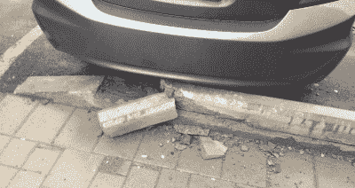
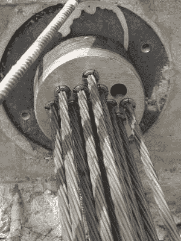
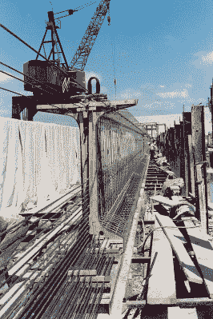

# 仔细观察预应力混凝土

> 原文：<https://hackaday.com/2020/09/29/a-good-hard-look-at-pre-stressed-concrete/>

从普通车道或人行道的外观来看，似乎混凝土注定会开裂。但是，如果混凝土如此容易开裂，我们怎么能在如此多的高应力应用中使用它，如桥梁和摩天大楼？这个问题是在我为一篇文章研究 3D 打印铝热剂的时候产生的。铝热剂经常被用于焊接铁轨，我链接了一个视频，是新焊接的有混凝土枕木的铁轨。我知道我必须找出混凝土如何能够承受货运列车的压力。

就其本身而言，混凝土是脆弱的，没有任何弹性。但这并不意味着它不强大。混凝土虽然抗压强度好，但抗拉强度相当差。大约在 19 世纪晚期，有人想到用钢筋加固混凝土跨度，更好的说法是螺纹钢。钢可以拉伸，加入钢筋可以使混凝土具有一定的抗拉强度和抗压强度。钢筋也允许更薄的板和其他成员。

## 钢筋只能到此为止

Parking blocks are meant to be replaced occasionally. Image via [Checkers Safety](https://www.checkers-safety.com/news/Parking-Stops-Rubber-vs-Concrete/)

钢筋或钢筋网混凝土对停车场和道路等东西来说是好的，但它仍然会在应该失效的时候失效。事实上，在钢筋的抗拉强度发挥作用之前，它通常必须开裂。

在像桥梁和摩天大楼这样的高应力混凝土应用中，避免偏转非常重要，因为这是混凝土构件在负载下发生挠曲和弯曲的时候。除了其他问题之外，挠曲会导致现代玻璃外壳从摩天大楼上脱落。

一座坚固的刚性桥比一座在微风中摇摆的桥更适合步行、驾驶和骑自行车。但是你如何建造一座刚性桥梁呢？一种解决办法是在混凝土承受汽车和卡车的负荷或稳定的货运列车之前对其施加应力。

预应力混凝土就像钢筋混凝土，但增加了额外的张力。通过在混凝土投入使用前对其施加应力，挠度将会减小，甚至可能完全消除。随着抗拉强度的增加，更多的混凝土自身强度能够发挥作用。

A tendon anchorage for post-tensioning. Image via [Wikipedia](https://upload.wikimedia.org/wikipedia/commons/7/73/Stressing_anchorage.jpg)

## 张紧方法

预应力混凝土是通过将钢筋束贯穿整个混凝土构件或其附近，然后从锚固点拉紧钢筋束以增加张力而制成的。这些钢筋束通常由高张力钢、碳纤维或用于防弹织物的芳纶纤维制成。它们排列成单股或多股结构，有点像橡皮筋。

预应力混凝土的结果是，未来的压力将使服役构件的行为像超级混凝土，未来的拉力将使其行为更像高张力钢。换句话说，预应力混凝土比普通混凝土更能承受压力甚至扭曲。它本质上是可编程的，因为它是以一种经过计算的方式预加应力的，这种方式模拟了它一旦投入使用将承受的应力。

预应力中的“预”是指它发生在混凝土构件投入使用之前。张拉本身既可以在混凝土浇注前进行，也可以在混凝土凝固后进行。使用这种或那种方法有各种各样的原因，但就结果而言，它们几乎是一样的。

A casting bed for girders. Image via [Wikipedia](https://commons.wikimedia.org/wiki/File:AASHTO_Girder.jpg)

### 预拉伸:浇注前

这是最古老的混凝土预应力方法，可以追溯到 19 世纪晚期。预拉伸通常用于制作横梁、楼板、阳台、水箱和混凝土管道。在浇注混凝土之前，钢筋束被固定在端锚之间，无论钢筋束是在混凝土内还是直接靠近混凝土。

当混凝土固化时，它粘在钢筋束上，钢筋束的张力传递到固化的混凝土上。松开螺栓后，杆保持拉紧状态，由混凝土固定。预拉伸通常在建设项目之前进行，完成的部件被运送到现场。这样，可以在一个叫做铸造床的大模具中一次制造多个。这些钢筋束由几根钢筋组成，一旦混凝土凝固后就被切断。

### 后张拉

如你所想，后张是在混凝土固化后进行的。在后张法中，钢筋束位于塑料或镀锌钢制成的套筒内，混凝土在套筒上浇注。混凝土浇注后，钢筋束被锚具拉紧，就像它们处于预拉伸状态一样。

有两种方法可以进行后张拉——粘结和非粘结。在有粘结后张拉中，灌浆在张拉前应用于钢筋束护套，这将钢筋束永久固定在混凝土上。这做了三件事:它防止腐蚀，它在拉紧发生之前锁定钢筋束，它改善混凝土的结构行为，一旦构件在那里做它的工作。在无粘结后张拉中，钢筋束位于锂基润滑脂填充的护套中，因此可以在混凝土中纵向移动。这些通常是事先在场外准备好的。

看看下面视频中的具体实验。预拉伸和后拉伸的混凝土构件都能够承受两倍于传统钢筋构件的力。这并不是说张紧的混凝土神奇地变得更强，只是它被允许发挥更大的强度潜力。实验结束后，一定要留下来，仔细看看混凝土铁路枕木的制作过程。

 [https://www.youtube.com/embed/P13Mau2VUWw?version=3&rel=1&showsearch=0&showinfo=1&iv_load_policy=1&fs=1&hl=en-US&autohide=2&wmode=transparent](https://www.youtube.com/embed/P13Mau2VUWw?version=3&rel=1&showsearch=0&showinfo=1&iv_load_policy=1&fs=1&hl=en-US&autohide=2&wmode=transparent)

 [https://www.youtube.com/embed/VCgsecotQkA?version=3&rel=1&showsearch=0&showinfo=1&iv_load_policy=1&fs=1&hl=en-US&autohide=2&wmode=transparent](https://www.youtube.com/embed/VCgsecotQkA?version=3&rel=1&showsearch=0&showinfo=1&iv_load_policy=1&fs=1&hl=en-US&autohide=2&wmode=transparent)

