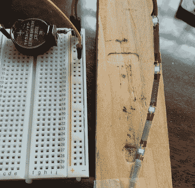

# 无限远镜子上令人毛骨悚然的扭曲

> 原文：<https://hackaday.com/2021/02/10/a-hair-raising-twist-on-infinity-mirrors/>

就在我们以为已经在无限镜部门看到了一切的时候，[FieldCrafting]用他们的[电镀无限镜发夹](https://www.instructables.com/Infinity-Mirror-Electoplated-Hair-Stick/)开辟了一条微小而闪亮的新路线。我们很想把这个放在我们的法式麻花里。幸运的是，[FieldCrafting]提供了从 3D 打印到电镀铜到镜面薄膜和电路应用的一步一步的指导。

 这是多么微小的电路啊！这个引脚由一个硬币电池供电，甚至有一个微型滑动开关来保存它。棍子部分是一对织针，这是一个好主意——它们足够尖，可以穿过头发，但又不会尖到伤人。

[FieldCrafting]计划将 1206 个 led 焊接到铜带上，并用它来填充空腔，但不知何故 CAD 文件以 0603 结尾，因此没有足够的空间来放置两条胶带迹线。我们认为这可能是更好的——[field crafting]的解决方案是使用双导线，有策略地剥离，这似乎比试图保持两条裸露的胶带迹线分开并通过小精灵要简单得多。

没有足够的头发来做这个吗？当然，你可以用一些漂亮的无限杯垫来完善你的家庭酒吧布置。