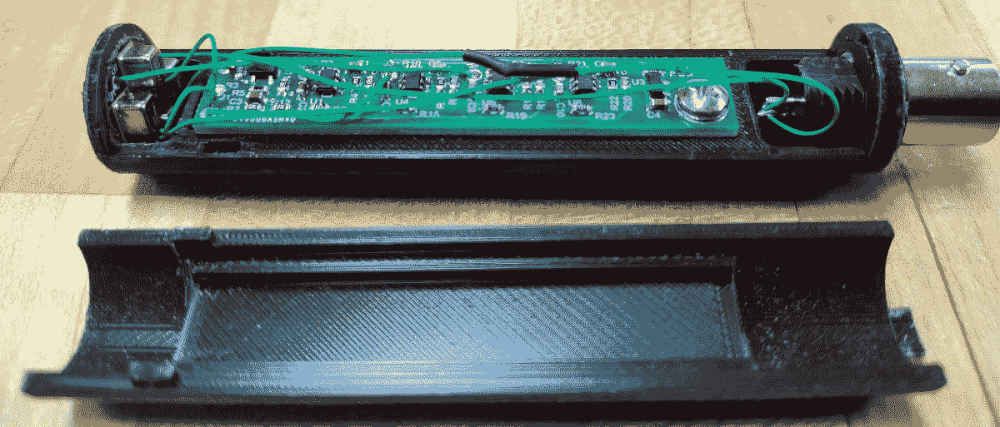

# 一个实验室级测量麦克风，价格不贵

> 原文：<https://hackaday.com/2022/06/08/a-lab-grade-measurement-microphone-for-not-a-lot/>

任何测量的质量都取决于用来采集测量数据的仪器，而对于声学测量来说，找到一个足够好的仪器会异常困难。市面上常见的麦克风可能具有良好的品质，但由于它们总是为演讲或音乐而设计，因此不需要仪表麦克风所需的平坦或足够宽的响应和低噪声系数。

用于测量目的的麦克风可能需要很高的费用，但这里的[Peter Riccardi]有一个围绕 MEMS 胶囊阵列设计的单元[，其性能相当于成本的一小部分](https://hackaday.io/project/185762-mems-based-iepe-powered-instrumentation-microphone)。

对于我们这些对音频感兴趣的人来说，这是一个非常有趣的项目，对于那些仅仅是好奇的人来说，这是一个深入研究其设计的一些方面的项目。它使用四个振膜来抵消感应的电噪声，并在与商业测量麦克风进行测试时拥有一些令人印象深刻的对比测量。我们几乎可以看到自己在建设这个项目。

对音频技术感兴趣？试试我们的 [*知音*系列。](https://hackaday.com/2021/06/02/know-audio-start-at-the-very-beginning/)