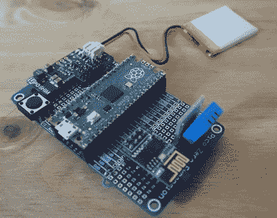

# 无情的环境监控系统

> 原文：<https://hackaday.com/2022/08/10/a-merciless-environmental-monitoring-system/>

我们已经在 Hackaday 上看到了大量的环境监测设置——无线传感器遍布房屋，所有传感器都将温度和湿度数据上传到藏在某个壁橱里的中央服务器。来自*车间*的【安迪】组装的系统大同小异，除了这一次[服务器被设计得尽可能明亮大胆](https://www.workshopshed.com/2022/08/inspired-by-flash-gordon/)。

Mosquitto、InfluxDB、Node Red 和 Grafana (M.I.N.G)的使用让[Andy]想起了 *Flash Gordon* 中的无情明，这反过来又启发了容纳树莓 Pi、硬盘和电源的外壳。一些 3D 打印的细节有助于销售外观，涂漆的金属网格板确保有足够的气流。

 虽然服务器固然引人注目，但传感器本身也值得仔细观察。你可能会认为传感器是基于 ESP 家族的某个成员，但在这种情况下，[Andy]选择了树莓派 Pico。由于该项目先于电路板的无线版本[发布，他不得不添加一个用于通信的 ESP-01 以及 DTH11 温度和湿度传感器。](https://hackaday.com/2022/06/30/raspberry-pi-pico-w-adds-wireless/)

对于电源，每个传感器都包括一个 1200 mAh 的袋状电池和一个 Pimoroni LiPo SHIM，尽管他指出 Pico 的节能模式带来了一些挑战。一个 perfboard 将所有组件组合在一起，整个产品都放入一个低调的 3D 打印外壳中。

如果你的无线传感器走 ESP8266/ESP32 路线，[我们已经看到了一些非常整洁的封装，值得一试](https://hackaday.com/2019/11/28/a-printed-case-for-your-esp-environmental-sensors/)。或者如果你更喜欢使用现成的东西，我们是为小米蓝牙温度计开发的[定制固件的忠实粉丝。](https://hackaday.com/2020/12/08/exploring-custom-firmware-on-xiaomi-thermometers/)

 [https://www.youtube.com/embed/rdKqaxvn1fA?version=3&rel=1&showsearch=0&showinfo=1&iv_load_policy=1&fs=1&hl=en-US&autohide=2&wmode=transparent](https://www.youtube.com/embed/rdKqaxvn1fA?version=3&rel=1&showsearch=0&showinfo=1&iv_load_policy=1&fs=1&hl=en-US&autohide=2&wmode=transparent)

