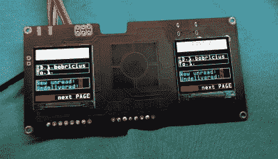

# 廉价的微控制器友好型增强现实耳机

> 原文：<https://hackaday.com/2021/09/02/a-microcontroller-friendly-ar-headset-on-the-cheap/>

生成增强现实(AR)护目镜所需的实时图像通常需要相当大的处理能力，以至于围绕 Raspberry Pi 的 DIY 工作经常难以跟上。但是如果你的 AR 愿望不需要花哨的高分辨率图形呢？如果文字和偶尔出现的图标足以完成工作，那么[这些来自【bobricius】的高保真护目镜可能是理想的解决方案](https://hackaday.io/project/179843-low-cost-augmented-reality-vr-for-microcontroller)。

与我们之前看到的自制 AR 设备一样，这款设备以[一款经济实惠的耳机开始，旨在将智能手机的显示屏](https://hackaday.com/2019/02/18/immersive-augmented-reality-on-a-budget/)投影到一对曲面光学组合器上。但[bobricius]没有将手机塞进耳机，而是使用了一个定制的 PCB，可以容纳一对 ST7789 1.3 英寸 240 x 240 IPS 显示器。通过 SPI 连接，并由您喜欢使用的几乎任何微控制器支持，只需几行代码就可以将一些文本数据放到您的视野中。

【bobricius】已经为这个项目整合了几个不同版本的 PCB。其中一个使用他定制的基于 at amd 21 e 18 的“ArmaBrain”模块，该模块将 MCU 和一系列常见组件封装在一个 28 mm 的方形板上，可以很容易地放入其他项目中。如果您更愿意推出自己的解决方案，第二个版本的电路板只需将两个显示器固定在适当的位置，并将 SPI 线路由至一个方便的接头即可。

[在](https://hackaday.com/2020/12/31/augmented-reality-on-the-cheap-with-esp32/)之前，我们已经见过使用 ESP32 等微控制器的增强现实显示器，但这些基本上只是更强大系统的远程显示器。我们喜欢这种简化的方法，因为在很多应用程序中，只需获得几行文本或一些低分辨率图像就足以完成手头的任务。另外，这个项目所基于的商用耳机看起来肯定比[过去我们考虑过修改的一些其他捐助者的护目镜要好](https://hackaday.com/2021/05/26/teardown-radica-i-racer/)。

 [https://www.youtube.com/embed/zkJtF4IpNOA?version=3&rel=1&showsearch=0&showinfo=1&iv_load_policy=1&fs=1&hl=en-US&autohide=2&wmode=transparent](https://www.youtube.com/embed/zkJtF4IpNOA?version=3&rel=1&showsearch=0&showinfo=1&iv_load_policy=1&fs=1&hl=en-US&autohide=2&wmode=transparent)

The [HackadayPrize2021](https://prize.supplyframe.com) is Sponsored by: