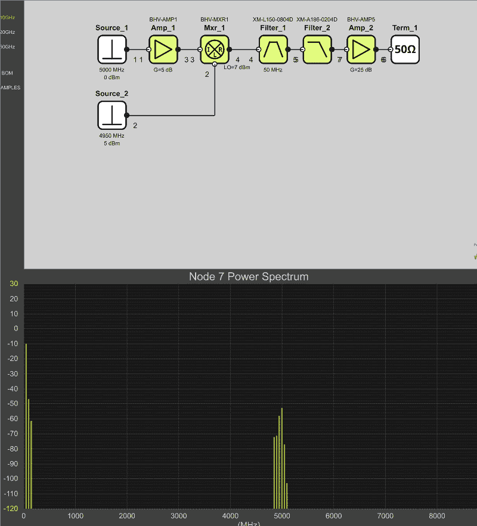

# 一套微波安装机

> 原文：<https://hackaday.com/2018/07/16/a-microwave-erector-set/>

RF 设计并不总是容易的，尤其是在较高频率下。尽管模拟工具有所改进，但仍然无法替代原型制作和尝试不同的东西。当这意味着在一块木头上钉几个钉子，并连接分立元件时，这并不是那么糟糕。但在今天的微波频率和今天的 IC 封装，这根本行不通。解决这个问题是推动一家名为 [X-Microwave](https://www.xmicrowave.com/) 的公司的动力。它们有一个标准的栅格图案 PCB，用于连接各种 RF 电路和附件。了解该系统的最佳方式可能是观看下面的简单视频。还有一个值得注意的免费模拟器工具，稍后您会看到。

在你过于兴奋之前，我们要提醒你，虽然如果你需要的话，这些东西很便宜，但这不是冲动购买。基板和探针(连接器)从 150 美元到 300 美元不等。你也可以得到套件，但一个基本的双端口系统将从大约 550 美元开始，这是大约 100 美元的零部件和一些额外的东西。然后，如果你需要的话，你需要更便宜的零件来制作物品周围的盒子。哦。那么你也需要不便宜的印刷电路板。正如你所料，它们的价格相差很大，但是，例如，我们看到放大器低至 80 美元，高至近 1000 美元。所以一个完整的系统可能会非常昂贵。

然而，如果你真的需要在微波区域对 RF 电路进行试验，他们声称该系统可以达到 50 GHz，与你要做的其他事情相比，这些价格并不是不合理的。

此外，有一个免费的基于浏览器的模拟器，你可以尝试，这是非常强大的。您确实需要注册(虽然注册似乎失败了，但实际上成功了)。模拟器的后端是 Genesys Spectrasys，因此这实际上是获得非常强大的 RF 模拟工具的有限访问权的一种廉价方式。花了一段时间才弄明白，但是你可以通过右击任何黑线来填充屏幕底部的光谱显示。您可以选择理想的行为模型或对应于真实世界 X-Microwave 模块的模块。还有一个在线布局工具用于规划电路布局，但没有模拟器那么令人兴奋。

这是那些如果你需要它，它是负担得起的事情之一。如果你没有，那么它的价格是天文数字。然而，不难想象自制类似的东西，尤其是如果您的频率需求更适中的话。我们可以建议以 [RF 饼干](https://hackaday.com/2016/03/26/rf-biscuit-is-a-versatile-filter-prototyping-board/)作为起点。如果你太便宜而不能走这条路，你可以看看[箔带](https://hackaday.com/2017/07/25/rapidly-prototyping-rf-filters/)。我们用铝箔胶带制作了完整的发射器和接收器，以制造特殊的“电路板”

感谢[RoGeorge]在 Hackaday.io 上提到这个系统。

 [https://www.youtube.com/embed/o7zYtF5dE3c?version=3&rel=1&showsearch=0&showinfo=1&iv_load_policy=1&fs=1&hl=en-US&autohide=2&wmode=transparent](https://www.youtube.com/embed/o7zYtF5dE3c?version=3&rel=1&showsearch=0&showinfo=1&iv_load_policy=1&fs=1&hl=en-US&autohide=2&wmode=transparent)

