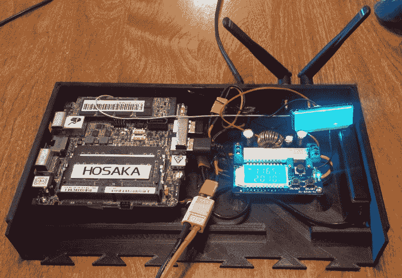
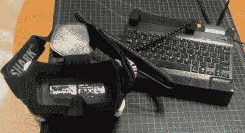

# 让威廉·吉布森嫉妒的移动电脑

> 原文：<https://hackaday.com/2018/07/28/a-mobile-computer-to-make-william-gibson-jealous/>

科幻小说、电影和游戏中的个人电脑比我们在现实世界中使用的小硬件要酷得多。诚然，现代笔记本电脑比过去的米色盒子更有风格，但它们仍不及《黑客》中定制 PowerBooks 的 l33t 的一半。对于那些梦想进入黑客帝国的人来说，幸运的是，普通黑客现在已经能够获得按照他们希望的任何奇特规格制造定制计算机所需的技术。

 一个完美的例子就是[【锡箔 _ 小百货】](https://imgur.com/a/h2kR0Gs)创造的这个“赛博甲板”。受威廉·吉布森的*神经漫游者*的启发，这款看起来很狂野的机器不仅仅是一个角色扮演道具或谈资。它有足够的能力作为日常驾驶电脑，以及一些特别的功能，使它非常适合野外工作。

cyberdeck 的主体是 3D 打印的，但由于[Tinfoil_Haberdashery]没有足够大的 3D 打印机来完成整个工作，他不得不将其分成几个部分。他在每件作品的边缘添加了燕尾图案，这比简单地粘合在一起更牢固。如果你发现自己需要打印一些很大的东西，这是一个很有价值的建议。

覆盆子 Pi 的爱好者可能会失望地看到里面的英特尔 NUC 主板；它在一个令人难以置信的小封装中配备了 3.4 Ghz 双核 CPU、8 GB 内存和 500 GB 固态硬盘。为了保持一切运转，这台机器可能需要多达 12 个 18650 单元，使它的最大运行时间为 16 小时左右。甚至还有一个 12 V 电源插孔，这样他就可以在必要时用甲板上的电池给烙铁和其他低压设备供电。集成充电器可以从 6 到 30 伏的任何地方，这使[锡箔 _Haberdashery]能够从各种来源充电。

 但也许网络平台最大的特点是展示。它使用了 Fat Shark Transformer，这是一款为 FPV 无人机设计的 5 英寸 720p 显示器，不仅可以折叠平放在甲板上进行存储，还可以拆卸下来放入一副护目镜中。这给了 cyberdeck 一个头戴式显示器，看起来就像电影里的东西。如果你愿意将分辨率减半，它甚至支持 3D。

在 DIY 的世界里，事情已经有了很大的进展[头戴式电脑显示器](https://hackaday.com/2009/10/27/head-mounted-computer-with-spit-bailing-wire/)。真的会让你想知道在未来 10 年左右的时间里，专业的黑客将会做些什么。

[via[/r/赛博朋克](https://www.reddit.com/r/Cyberpunk/comments/8yyayp/just_designed_and_3d_printed_a_cyberdeck_time_to/)