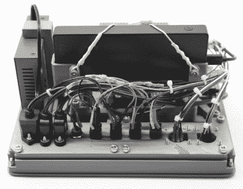

# 世界末日的移动终端

> 原文：<https://hackaday.com/2019/11/11/a-mobile-terminal-for-the-end-of-the-world/>

如果文明向侧面发展，你需要生存，你的掩体里应该放些什么最基本的东西？食物和淡水，当然。也许是一些可以用来交换的东西，以防东西装满了邮递员。这些都很合理，但是这些东西如何帮助你举办一个局域网聚会呢？如果你有点像[杰伊·多舍尔]，你会确保当炸弹落下时，有一个[加固的树莓 Pi 系统和一个独立的网络](https://back7.co/home/raspberry-pi-recovery-kit)陪着你。

 或者至少，它看上去的确是那么回事。他成功地设计了整个项目，所以它不需要在作为外壳的鹈鹕壳上钻孔，这意味着它是尽可能密封的电子产品。整个系统可以完全浸没在水中，出来时内部完全干燥，并且没有内部移动部件，因此很大程度上不会受到跌落和冲击的影响。

但是我们想象[Jay]实际上不需要等到核冬天，他就可以使用这个华丽的移动设备。随着 Pi 的 GPIO 突破到前面的双军用风格面板安装连接器，一个真正的机械键盘，和一个集成的五端口以太网交换机，您将不会有任何麻烦得到这台机器的合法工作；即使你最接近后世界末日地狱的场景是没有暖气的车库。我们特别喜欢带有集成标签的 3D 打印前面板，这是一个很好的提示，坦率地说，我们几乎没有看到足够的提示。

这实际上是[Jay]在 2015 年建造的 [Raspberry Pi 现场设备(RPFU)的进化版本。他告诉我们，他想更新设计，以展示他在过去几年中作为一名黑客和制造者的个人成长，从最终产品来看，我们认为可以肯定地说他走在正确的道路上。](https://hackaday.com/2015/08/13/raspberry-pi-field-unit-rpfu/)