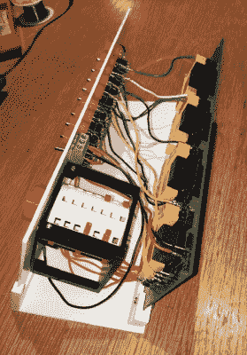

# 对“回形针电脑”的现代诠释

> 原文：<https://hackaday.com/2020/02/08/a-modern-take-on-the-paperclip-computer/>

早在 1968 年，一本名为*“如何建立一个工作的数字计算机”*的书声称，足够专注的读者可以在家里使用容易获得的组件组装自己的功能计算机。最值得注意的是，该设计利用了许多由弯曲的回形针制成的元素。目前还不清楚有多少读者真的组装了一台所谓的“曲别针电脑”，但今天我们很高兴地报告[【迈克·盖迪】已经完成了他对 50 多年历史的自制电脑](https://hackaday.io/project/168833-wdc-1-a-working-digital-computer)的解读。

A view behind the computer’s ALU

纯粹主义者可能会失望地看到[迈克]已经偏离了原来的那么远，但我们认为他对现代建筑技术的拥抱是必要的升级。他重新创造了书中描述的单个计算机组件[，但这一次胶合板和小麦灯泡让位于 3D 打印面板和 led。虽然细节可能有所不同，但最终目标是相同的:操作员可以理解的规模的可编程数字计算机。](https://hackaday.com/2015/10/19/diy-computer-1968-style/)

说[迈克]在记录他的构建方面做得很好是一种保守的说法。在过去的几个月里，他在 Hackaday.io 上报道了构建的各个方面，让他的追随者们对如此规模的项目有了一个奇妙的了解。他可能没有为他的工作数字计算机(WDC-1)折过多少回形针，但他确实设计并制造了许多令人印象深刻的定制组件。如果他们中的一些人，比如我们上个月报道的 3D 打印滑动开关开始出现在其他项目中，我们不会感到惊讶。

虽然 WDC-1 是他最近的，当然也是最大的胜利，但[迈克]对再造早期的数字计算机并不陌生。我们已经[给你们带来了他令人印象深刻的复制品有一段时间了](https://hackaday.com/2019/08/08/the-geniac-lives-again/)，每一个条目[都比上一个](https://hackaday.com/2019/06/17/a-faithful-replica-of-an-early-computer-trainer/)更加令人印象深刻。WDC-1 将标准设定得如此之高，我们迫不及待地想看看他接下来会推出什么。

 [https://www.youtube.com/embed/dHUUe2LERaM?version=3&rel=1&showsearch=0&showinfo=1&iv_load_policy=1&fs=1&hl=en-US&autohide=2&wmode=transparent](https://www.youtube.com/embed/dHUUe2LERaM?version=3&rel=1&showsearch=0&showinfo=1&iv_load_policy=1&fs=1&hl=en-US&autohide=2&wmode=transparent)

