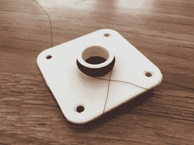

# 一个 3D 打印的扬声器

> 原文：<https://hackaday.com/2019/04/17/a-mostly-3d-printed-speaker/>

普通的磁性扬声器基本上是一种相当简单的机器。永磁体产生静磁场，膜片与线圈机械连接。当变化的电流通过线圈时，这导致线圈由于磁场而移动，振动薄膜并产生声音。用一个简单的 3D 打印扬声器将这一理论付诸实践。

 [这不是我们见过的第一个 3D 打印的扬声器](https://hackaday.com/2015/01/27/3d-printed-speaker-pushes-rapid-prototyping-boundaries/)，但它是最可爱的一个。扬声器的主体是长方形的，有一个空腔，其中放置了三个钕磁铁。然后单独印刷振动膜，包括线圈缠绕在其上的集成轴。组件由一些内六角螺钉固定在一起，这些螺钉补充了令人愉快的现代外观。

当连接到 Arduino 时，该设备在传递哔哔声方面做得很好，我们可以看到这种基本设计在各种迷人的 3D 打印建筑中表现良好。休息后的视频。

 [https://www.youtube.com/embed/3VsehOYY73M?version=3&rel=1&showsearch=0&showinfo=1&iv_load_policy=1&fs=1&hl=en-US&autohide=2&wmode=transparent](https://www.youtube.com/embed/3VsehOYY73M?version=3&rel=1&showsearch=0&showinfo=1&iv_load_policy=1&fs=1&hl=en-US&autohide=2&wmode=transparent)

