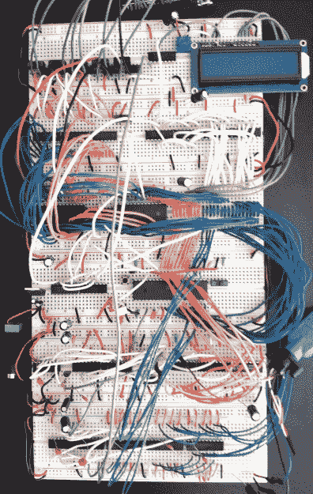

# 近乎实用的 6502 试验板计算机

> 原文：<https://hackaday.com/2019/04/19/a-nearly-practical-6502-breadboard-computer/>

这些年来，我们已经看到许多自制的 6502 电脑仅仅用一块试验板、一袋跳线和一种让和尚都嫉妒的超凡耐心组装而成。任何人只要花时间在工作台上一字排开的半打试验板上组装一台全功能电脑，他将永远是我们书中的超级明星。

 虽然我们仍然懒得自己尝试这些构建之一，但我们不得不承认[[尼克·比尔德]的 Vectron 64 看起来非常危险地接近你可能能够在合理的时间内完成的东西](https://hackaday.io/project/165050-vectron-64)。这仍然是一个令人难以置信的工作量，但与我们见过的其他一些项目相比，由于使用了一个简单的 16×2 LCD 输出和 PS/2 键盘提供的用户输入，这个项目成功地保持了相对较低的部件数量。你不会在上面玩*波斯王子*，但至少你可以在一个周末内完成。

该计算机的时钟频率为 1 MHz，具有 32KB RAM
和 32KB EEPROM。这对任何人来说都足够了。[Nick]还指出，他尽可能使用适合时代的 7400 系列集成电路，因此无需担心历史修正主义。如果你在寻找一个设计，有人可能在 20 世纪 70 年代就已经把它拼凑起来了，这个设计会让你非常接近。

敏锐的读者可能会注意到这个版本中没有可移动介质，并且可能会想知道如何加载程序。为此，[Nick]给了自己一点现代的便利，想出了一个方案，允许 Arduino(或类似的微控制器)连接到计算机的 28C256-15 EEPROM。有了运行在你“真正”计算机上的 Python 脚本，你可以直接在芯片上写一个新的 ROM 镜像。他提供了一个简单程序的源代码，该程序可以将您在键盘上输入的任何内容显示在 LCD 上，这将为您编写其他软件提供一个良好的框架。

如果你在寻找更大的挑战，不要担心。我们已经报道了 6502 台试验板电脑会让你热泪盈眶。顺便说一句，这不是我们第一次看到[在这些电脑](https://hackaday.com/2017/08/21/this-6502-computer-project-is-a-work-of-art/)中使用类似的液晶显示器，所以看起来在有意义的现代部件中偷偷摸摸没有什么可羞耻的。