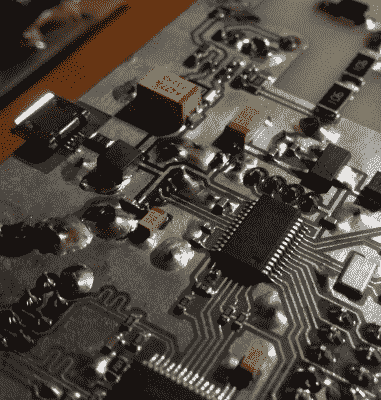

# 网络附加辐射监测器

> 原文：<https://hackaday.com/2019/02/13/a-network-attached-radiation-monitor/>

开始只是个玩笑，有时候事情就是这样。[Marek wi cek]认为建造一个个人辐射探测器不仅会给他一些工作上的东西，而且就像是从游戏中得到一个小玩意。他会时不时地检查数据，还会笑一笑。但后来事情变得真实了。当他开始在社交媒体上看到附近的一个核反应堆遭受某种辐射泄漏的谣言时，他的“笑话”辐射探测器突然变成了严肃的事情。

 由于意识到拥有自己的详细环境数据来源可能并不是一个坏主意，[【马雷克】开发了一种更精致的原始探测器](https://forbot.pl/forum/topic/12772-ethergeiger-sieciowy-detektor-promieniowania-jonizujacego/) ( [谷歌翻译](https://translate.google.com/translate?sl=auto&tl=en&u=https%3A%2F%2Fforbot.pl%2Fforum%2Ftopic%2F12772-ethergeiger-sieciowy-detektor-promieniowania-jonizujacego%2F))。这个小装置包括一个盖革计数器，以及用于温度和气压等普通数据点的传感器。因为它是一个固定的监控设备，他甚至把它设计成直接插入以太网，这样就可以通过 TCP/IP 进行轮询。

[Marek]围绕苏联时代的 STS-5 盖革管进行设计，并为他的电路板配备了高压电子设备，以提供所需的 400 伏电压。温度、大气压力和湿度通过流行的博世 BME280 传感器读取。如果没有以太网可用，来自传感器的数据可以存储在内置的 SPI 闪存芯片或标准的 USB 闪存驱动器上。

监视器由 PIC32MX270F256B 微控制器供电，该微控制器带有 ENC28J60 芯片提供的以太网接口。实际上，[Marek]有一个中央 Raspberry Pi，它通过网络轮询监视器，收集它们的数据并将其放入基于 web 的仪表板。他对这种设置很满意，但提到他计划在电路板上添加一个 LCD 显示屏，这样就可以直接从设备上读取数值。他还表示，未来的版本可能会增加 WiFi，以便在偏远地区更容易部署。

这些年来，我们已经看到了相当数量的辐射监测器，从太阳能 WiFi 连接装置到令人难以置信的工作[【拉杜·莫蒂桑】已经建立了他的全球辐射探测器网络](https://hackaday.com/2015/12/07/globally-distributed-sensor-net-monitors-air-quality-and-radiation/)。当谈到辐射的危险时，黑客们似乎不愿意相信别人的话。