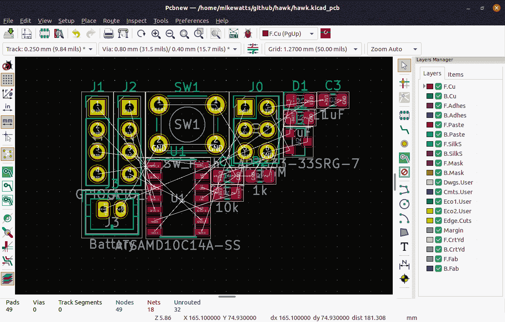

# 一个新的 KiCAD 教程登场了

> 原文：<https://hackaday.com/2019/07/29/a-new-kicad-tutorial-hits-the-scene/>

KiCAD 对于初学者来说有一个理所当然的形象问题。闪亮的新版本 5 有所改进(我们对版本 6 感到非常兴奋！)但即使是来自电子设计背景，这个工具也有点迟钝，所以我们总是很高兴看到新的学习材料。[Mike Watts]是最近加入到受人尊敬的团队中的一员，他愿意在 GitHub 上发布他的 KiCAD 教程系列[带着有抱负的用户从原理图到 fab 和组装。](https://github.com/MalphasWats/hawk)

本教程主要介绍为 dimuitive Microchip née Atmel at amd 10 Cortex M0 ARM CPU 创建开发板的过程。它首先要求读者创建一个示意图，然后通过指导他们执行某些动作来进行教学，然后解释正在发生的事情以及哪些快捷方式可以加快速度。这种方法贯穿于布局、制造和装配。

值得注意的是，在定义电路板轮廓时,[Mike]描述了如何使用 [OpenSCAD](https://www.openscad.org/) 对其进行参数化定义；一个整洁的微型教程，介绍如何使用这两个伟大的工具来相互补充。我们还喜欢在成功完成教程系列后，用户将开发出一个微小但有用的开发板，单次组装只需大约 3 美元！

与所有开源工作一样，如果您有任何疑问或想要做出贡献，请打开一个 pull 请求，帮[Mike]一把！