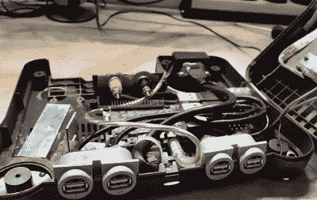

# 对构建便携式 N64 的新看法

> 原文：<https://hackaday.com/2018/10/02/a-new-take-on-building-a-portable-n64/>

当家用游戏机变得可移动时，无论是以改装的原始硬件还是仿真的形式，它们通常都采用非常标准的形状。中间有一个屏幕，两侧或下方有按钮。基本上相同的布局任天堂普及与生俱来的手持系统，如游戏和手表系列和原始游戏男孩。就像俗话说的，如果它没有被打破…

 但【勒讷达尔多】却有不同的想法。他偶然发现了一个坏了的 N64，想把它变成一个便携式控制台，但不一定是一个*手持*的。他注意到这个盒子的大小正好可以容纳一个小液晶显示器，而且放在一个理想的位置上，于是他开始着手对“便携式 N64”进行我们所见过的最字面的解释[。这可能不是这个概念的最实际的迭代，但它绝对为风格加分。](https://www.youtube.com/watch?v=tNxAg8Npn40)

在他剥离了 N64 的原始硬件后，他安装了一个 Raspberry Pi 3 和一个 RC 电池消除器电路(BEC)，以从内部 6200 mAh 7.4V 电池中获得 5V 电压。[Le Nerdarto]表示，这可以为 Pi、LCD 和各种照明系统提供长达 10 小时的电力。他还在系统前面为控制器添加了 USB 端口，并在后面添加了 HDMI 端口，这样他在不移动时仍可以将系统连接到电视。

墨盒中的 3.5 英寸液晶显示器可以说是该产品的核心，虽然它可能有点小，但我们不能否认这是一个聪明的想法。[Le Nerdarto]很明智地将显示器向后倾斜了几度，以使其处于更舒适的角度，但除此之外，它看起来很普通，因为他能够在不切掉捐赠墨盒背面的情况下将所有东西都放进去。对于那些可能会感到奇怪的人来说，“墨盒”不能被删除，但我们承认这将是一个杀手级的功能，特别是在背面有 HDMI 端口的情况下。

当然，由于它是在 Raspberry Pi 上运行模拟器，这不仅仅是便携式 N64。前置 USB 端口允许他插入各种控制器，并模拟几乎任何比 N64 本身更老的控制台的经典产品。具有讽刺意味的是，Raspberry Pi 3 并不是 N64 模拟的理想选择，但至少有很多游戏是可以玩的。

如果你是一个纯粹主义者，想要一个真正的便携式 N64，我们已经在 T2 报道了很多，给你灵感。

 [https://www.youtube.com/embed/9A55koU7TZ8?version=3&rel=1&showsearch=0&showinfo=1&iv_load_policy=1&fs=1&hl=en-US&autohide=2&wmode=transparent](https://www.youtube.com/embed/9A55koU7TZ8?version=3&rel=1&showsearch=0&showinfo=1&iv_load_policy=1&fs=1&hl=en-US&autohide=2&wmode=transparent)

