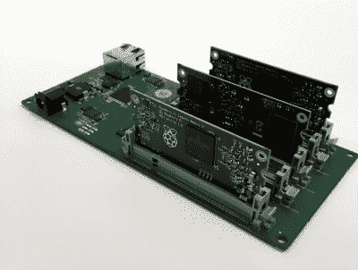

# 小心地挂在袜子里的 Pi 串

> 原文：<https://hackaday.com/2018/12/12/a-pi-cluster-to-hang-in-your-stocking-with-care/>

又到了一年中的这个时候，随着假期的临近，朋友和家人会缠着你，问你他们可以用什么样的小饰品和闪亮的小玩意来假装给你惊喜。不幸的是，没有比制造商或黑客更难找到的人了:如果我们想要，我们可能已经造好了。或者至少是从别人的垃圾桶里找到的。

 但是如果他们绝对地、肯定地、简单地*让*给你买商业制造的东西，那么你可以做得更糟，而不是向他们推荐[这个来自【miniNodes】](https://www.mininodes.com/product/5-node-raspberry-pi-3-com-carrier-board/)的非常光滑的树莓 Pi 集群背板。凭借支持多达五个经常被忽视的 Pi 计算模块的能力，这款小设备将让您无需从头开始构建就可以将强大的小 ARM 集群上线。

与全尺寸的 Raspberry Pi 相比，计算模块的尺寸要小得多，因此非常适合这样的集群应用，但我们并没有经常使用它，因为它需要插入到适当的 SODIMM 连接器中。这使得它实际上对原型和快速拼凑的黑客(即大多数人使用 Pi 的所有东西)毫无用处，并且实际上只适合成品和工业应用。玩弄圆周率和将圆周率付诸实际工作之间确实有一条界线。

[miniNodes]将他们方便的小设备称为载板，除了显而易见的五个用于 pi 的 SODIMM 插槽，还有一个集成的千兆位交换机，带有一个上行端口，可以将它们全部连接到网络。该板通过以太网插孔对面的一个桶形连接器为所有节点供电，留下了我们通常在 Pi 集群中看到的大量蜘蛛网状 USB 电缆。

259 美元的主板并不便宜，加上五个 Pi 计算模块将花费您 150 美元。但是，对于票价来说，您将拥有一个 20 核 ARM 集群，在 200 x 100 毫米(8 x 4 英寸)的尺寸中有 5 GB 的 RAM 和 20 GB 的闪存，在节气门全开时运行的能耗低于 20 瓦。对于移动应用程序，或者如果您只想在桌面大小的设备上试验并行处理，这可能是一个极好的选择。

[亚马逊为即将到来的 ARM 服务器革命](http://hackaday.com/2018/12/03/amazon-thinks-arm-is-bigger-than-your-phone/)做好准备了吗？在像这样的产品和我们多年来看到的[许多 DIY ARM 集群](https://hackaday.com/2018/07/05/nanopi-cluster-is-quiet-cool-and-has-blinky-lights/)之间，看起来我们将成为[把勇敢的架构带进高性能计算的世界。](https://hackaday.com/2016/09/18/clustering-a-lot-of-raspberry-pi-zeros/)

【感谢 Baldpower 的提示。]