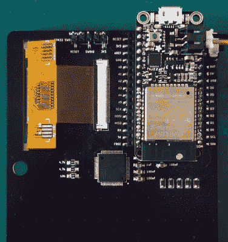

# 一个口袋大小的移动 Python 黑客终端

> 原文：<https://hackaday.com/2019/12/28/a-pocket-sized-terminal-for-mobile-python-hacking/>

受过去你的电脑可以直接启动到 BASIC 的美好时光的启发，[勒鲁·博登施坦]创造了一种他称之为“DumbDumb”的手持设备，它可以让你在一瞬间进入 MicroPython 环境。如果您对此不感兴趣，可以这样想:它是一个(相对)兼容 VT100 的串行终端，带有一个可以放入口袋的物理键盘。

 本质上只是一个哑终端(因此得名)，实际上板上没有太多硬件。除了 320×240 的 NewHaven 2.4 英寸液晶显示器之外，只有一个 STM32G071R8 微控制器和一些无源器件。当然，还有组成键盘的 57 个触觉按钮。

MicroPython 部分的出现得益于电路板背面接受 Adafruit 羽毛翅膀的位置。在这种情况下，它是 HUZZAH32，带有 ESP32，但它也可以与其他变体一起工作。由于有各种各样的羽毛板可用，这种终端实际上可以用于各种应用。

因此，即使摆弄 MicroPython 不是你的好主意，也几乎肯定有一些有趣的软件可以用于像这样的小型网络连接终端。例如，它可能正是你开始在劳拉传呼系统上工作所需要的。