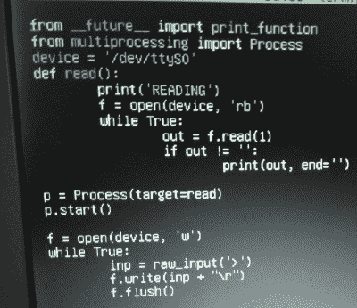

# Python 串行终端让您摆脱困境

> 原文：<https://hackaday.com/2019/11/28/a-python-serial-terminal-to-get-you-out-of-a-jam/>

摆弄旧电脑时，你偶尔会发现自己陷入困境。对于拥有 20 或 30 年历史的机器来说，考虑到可用的资源有限，用今天的硬件和软件完成一项简单的任务几乎是不可能的。这就是[bison]最近发现自己需要通过串行配置设备，但没有任何方法在他的富士通 Lifebook C34S 上安装合适的终端仿真器。

 他的解决方案，自从他在 Debian 6 机器上安装了 Python 2.6 之后，[就是自己编写最小的串口终端仿真器](https://github.com/bison--/emergencySerialConsole)。他打算让代码尽可能简洁，这样当其他人发现自己需要与 Linux 上的串行设备对话，但无法安装`screen`或`minicom`时，可以快速输入。

代码非常简单，即使您从未发现自己需要启动一个即兴终端，它也提供了一个有趣的例子来说明串行通信是多么简单。代码打开`/dev/ttyS0`设备进行读取，在添加适当的返回字符后，将用户的键盘输入推入其中。继续循环，你就有了一个交互式终端。

通过编写这个程序，[bison]能够将 266 MHz C34S 连接到他的 Retro WiFi SI，这是一种调制解调器适配器，可以在老式计算机和现代无线网络之间架起桥梁。像这些[的小工具可以让你按照创造者的意图](https://hackaday.com/2018/04/18/browsing-modern-day-bbs-on-the-epson-px-8-laptop/)浏览 BBS，并且可以被塑造成比运行一些开源代码的[ESP8266 更奇特的东西。](https://hackaday.com/2015/10/23/use-the-esp-as-a-serial-adapter/)