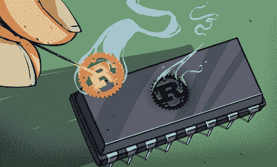
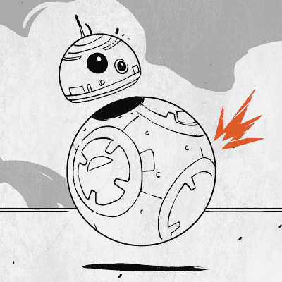

# 对个人软件项目的狂言

> 原文：<https://hackaday.com/2021/09/14/a-rant-on-personal-software-projects/>

浏览你的硬盘和 GitHub，你可能会发现成百上千的关于 Git 库的注释和框架。一个名副其实的软件侧项目的墓地。许多这些项目的典型流程是:获得一个想法，反复思考这个想法，直到它变得令人兴奋，最终变得比当前的次要项目更令人兴奋，记录被捕获，存储库被创建，工作以极快的速度开始，因为焦点和兴奋已经存在。可能会有一些重写或方向上的一些变化。项目是否值得或“这个项目实际上应该是什么”的问题开始出现。最终，随着这些问题越来越多，人们的热情逐渐消退。随着前进的道路看起来不像以前那样清晰，进展放缓。这个项目要么是夕阳西下，带着悲伤的承诺，总有一天会回来，要么静静地搁置一边，等待新的、令人兴奋的东西取而代之。听起来熟悉吗？也许不会，但这里的原则可能会有所帮助。

这篇特别的文章很大程度上是一个工程师对另一个工程师的看法。它是关于工程的过程，通过这个过程你可以设计一个项目来获得更好的结果。项目被搁置或废弃的原因有很多，但并不都是因为缺乏清晰的项目定义。在不清楚项目是什么的情况下，从更全面/更元的角度来考虑它会有所帮助。大体上有两种类型的个人项目:技术演示和产品。

## 0b10 个人项目类型

技术演示是关于技术或方法的。也许你正在尝试某种新的语言或者新的算法。半生不熟和笨拙是可以接受的，因为这不是它的设计初衷。它被设计成内部美观有趣。在某种程度上，当你离开的时候，这个项目就完成了，因为你得到了你想要的:学习。

Trying out Rust on a microcontroller is a fine reason for doing a project.

相比之下，产品个人项目关注的是它做了什么，以及最终用户与它交互的体验。也许它有一个很棒的自述文件，一个流畅的用户体验，或者做得比其他任何东西都好。关键在于，它关注的是使用它的最终用户，而不是制造它的人。它的内部是什么样子并不特别重要。它可以基于 COBOL，内部是一团意大利面条。干净的代码有助于维护和延长项目寿命，但对产品体验毫无益处。

简而言之，它是关于设计项目体验，而不仅仅是项目本身。它从一个更抽象的层面开始，从你将如何处理这个特殊的想法开始。是技术演示还是产品？这是一个容易取胜的项目吗？记住这些事情，你就可以开始问更好的问题了。允许你设计这将会是什么的问题。通过对你制作某样东西的过程有意识，你直接影响了你制作的东西。

## 让正确的问题成为你的向导

This robot looks awesome! If it’s all loose wire and hot snot on the inside, does it matter?

对于一个产品，你需要问最终用户是谁。即使用户是你，也不代表你就是静态的。自己写的老烂代码完全是故弄玄虚；为什么一个设计糟糕的老产品不会做同样的事情呢？产品是关于最终用户的，而不是开发者，即使他们是同一个人。

另一个好问题是，如果 Hackaday 写了我的项目，他们会关注和写些什么？(我会接着问“我是否包含了清晰、高分辨率的图片供他们使用？”)作为最终用户，想要的体验是什么，怎样才能更简单。把这些事情写下来会很有帮助。

拿出一个具体的计划，不要改变它或允许范围蔓延。如果出现问题，回到你之前问的问题，然后重新定义范围。尽量不要被技术分散注意力，而是专注于你正在努力做的事情。不要太纠结于怎么做。如何设计和制造产品的一个很好的例子是[Flipper Zero](https://hackaday.com/2021/07/24/how-the-flipper-zero-hacker-multitool-gets-made-and-tested/)。

对于技术演示，尽情享受吧。想在上面扔点别的吗？去吧。也许你正试图通过移植 Doom 来学习一些 web 汇编。因为没有范围，所以没有范围蔓延。如前所述，重点是开发人员，而不是用户。可用性不是这里的重点。问题可能是“什么最有趣”或“我如何跳过样板文件？”

## 但是我知道什么？

当然，这只是一个作者的观点，而且样本量只有一个。一个项目可能介于产品和技术演示之间，或者两者都不是。尽管如此，采用这些方法中的一些已经导致了对副项目工作的更多满意。你有不同的观点吗？当你完成你设定的目标时，你是移动目标还是后退一步去处理新的事情？