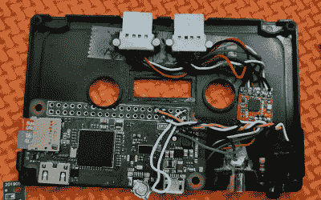

# 这款 ZX 频谱仿真器由一个树莓派打包盒驱动

> 原文：<https://hackaday.com/2021/03/18/a-raspberry-pi-packing-cassette-powers-this-zx-spectrum-emulator/>

有时我们模糊地意识到技术进步的不可阻挡的前进。其他时候，当我们过日子的时候，它会在我们的生活中不断地发出响声。有时候，只是有时候，它就在我们面前。

很少有项目能够像将一台完整的功能计算机放入一个曾经仅容纳数千字节数据的存储介质中那样，展示计算技术的进步和小型化。这正是[JamHamster]所做的，他把一个 Raspberry Pi Zero W 塞进一盒磁带里，运行他的 ZX 频谱模拟器。这是一个令人印象深刻的干净的建筑，它与[一个彻头彻尾的华丽，复古灵感，看起来像 CRT 的液晶显示器](https://jamhamster.wordpress.com/2020/11/30/making-a-crt-emulator-from-an-lcd/)非常相配，这是他的另一个创作。

这位私家侦探确实经历了一点小手术；尽管他在操作中只丢失了四个 GPIO 管脚。他还在一个高度抛光的铝制散热器中投入了大量的爱，这个散热器完全隐藏在机箱中，但确实能让电脑在幽闭的空间里保持凉爽。当然，[JamHamster]对这些磁带版本并不陌生。你可能会从[的 TZXDuino 上认出他的作品，这是 ZX 频谱](https://hackaday.com/2020/08/07/self-contained-tape-loader-for-the-zx-spectrum/)的虚拟磁带加载器。

老实说，有时我们不得不坐下来，对如此小的封装中所能容纳的计算机能力感到惊讶。Pi Zero 不是最小或最强大的选项，但它比这里模拟的计算机要强大得多。因此，无论它们是藏在过时的存储格式中，还是为看起来像股票一样的休眠 PSP 提供动力，我们都忍不住要留下深刻印象。