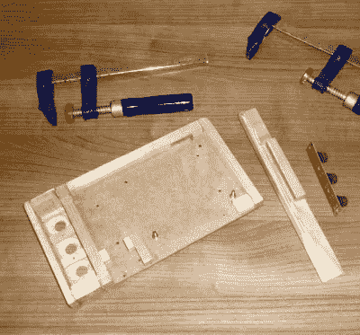

# 你可以在现代电脑上使用的复古触摸板

> 原文：<https://hackaday.com/2020/01/22/a-retro-touch-pad-you-can-use-on-modern-computers/>

正如[Jan Derogee]在休息后的仿复古视频中解释的那样，在经典的 8 位计算机上绘图有点痛苦。20 世纪 80 年代最基本的光笔和游戏杆允许自由形式的输入，但使用起来很笨拙。这就是为什么他着手[利用现代电子技术](http://home.kpn.nl/bderogee1980/projects/COMMO_PAD/COMMO_PAD.htm)为 C64 创造一个理想的绘图设备。为了完整起见，他还给了它一个 USB HID 模式，这样它就可以在更现代的电脑上工作了。

 他的设备，他称之为 Commo Pad，看起来像是从 20 世纪 80 年代直接运到这里的，但它是由全新的硬件建造的。这个箱子实际上是由木头制成的，经过打磨和上漆，赋予它我们都知道和喜爱的厚重的塑料美感，触摸板上的复古艺术作品真的对销售复古氛围大有帮助。

说到这里，触摸面板可能是整个构建中最有趣的组件。它实际上是一个电阻面板，本来是要安装到一个 LCD 上的，而[Jan]已经连接到一个 Arduino 上了。他所要做的就是为它提供一个稳定的框架，并打印出一些艺术作品放在它后面。

Arduino 和相关的电子设备允许 C64 将 Commo Pad 作为操纵杆或鼠标来使用，这意味着它不需要在计算机端使用任何定制软件。同样，如果你想把它插到 1982 年以后生产的东西上，它也可以模仿 USB 鼠标。如果你这么倾向于让它无线化，增加一个蓝牙似乎会相对来说微不足道。

如果 Commo Pad 对你的口味来说没有足够的复古未来感，[我们最近覆盖了一个定制的光学触摸板](https://hackaday.com/2019/10/06/building-a-cyberpunk-multi-touch-input-device/)，看起来它可以兼作*银翼杀手*的道具，这可能会达到目的。

 [https://www.youtube.com/embed/2GmSZj6bkRI?version=3&rel=1&showsearch=0&showinfo=1&iv_load_policy=1&fs=1&hl=en-US&autohide=2&wmode=transparent](https://www.youtube.com/embed/2GmSZj6bkRI?version=3&rel=1&showsearch=0&showinfo=1&iv_load_policy=1&fs=1&hl=en-US&autohide=2&wmode=transparent)

