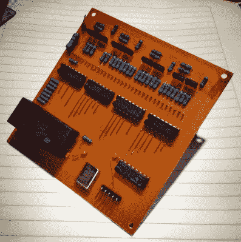

# 一个有内在美的临时搭建的 VFD 时钟

> 原文：<https://hackaday.com/2019/03/29/a-scratch-built-vfd-clock-with-inner-beauty/>

真空荧光显示器(VFD)是那些你再也看不到的漂亮的过时技术之一。它们曾经是消费电子产品的中流砥柱，但今天它们已经在很大程度上被更便宜、更节能的显示器所取代，如 led 和 LCD。虽然它们可能是客观上更好的展示，但看到现代厨房失去了那种明确无误的淡绿色，我们不禁感到一阵遗憾。

 如果他令人印象深刻的 VFD 时钟是任何迹象的话[【西蒙·贝劳】也有同样的感觉](https://github.com/Berraud/M48T08_Clock)。不仅时钟的显示立即引发了怀旧的浪潮，而且定制的 PCB 有着大约 1985 年消费电子产品的错误外观。如果我们不了解的话，我们会认为这东西穿越了时空。

好吧，如果不是因为电路板反面的 SMD ATmega328。除了 MCU 之外，该时钟还具有四个 ULN2003AN 达林顿晶体管阵列来驱动 VFD，以及一个 M48T08 实时时钟来保持整个系统正常运行。

细心的观察者可能会注意到时钟上明显缺少按钮或开关，并想知道这个复古的奇迹是如何设置的。在一次特别激进的攻击中，[Simón]在源代码中用硬编码变量设置时间；你只需要把它设定在未来足够远的地方，这样你就有足够的时间在适当的时候启动它。

[西蒙]已经将 ATmega328 的 Arduino 风格的源代码以及原理图和电路板文件放在了他的 GitHub 存储库中，以供其他任何人[可能想要沿着记忆之路](https://hackaday.com/2018/03/03/hacking-a-30-year-old-russian-vfd/)走一走。当你这样做的时候，你可能想[看看这些让未知的 VFD 启动并运行](https://hackaday.com/2018/01/21/quick-and-dirty-driver-tips-for-surplus-vfds/)的技巧，以及这个[有趣的解释，如果你真的在寻找时尚点，它们如何能被用作放大器](https://hackaday.com/2013/11/09/vfd-display-becomes-an-amplifier/)。