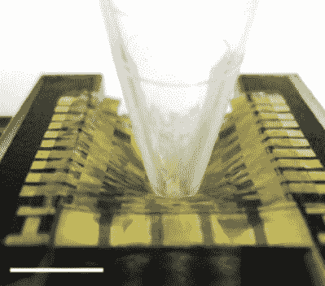

# 一种自我修复、可拉伸的电子皮肤

> 原文：<https://hackaday.com/2019/12/04/a-self-healing-stretchable-electronic-skin/>

在科学进展发表的一份报告中，一个来自美国和朝鲜的研究小组展示了一种应变敏感、可拉伸、自主的 T2 自愈半导体薄膜。换句话说，他们创造了一种能够自我调节的电子皮肤。是时候从玛奇纳的*开始播放结尾曲目了？不完全是。*

除了不可避免的需要很长时间才能看到材料投入生产之外，提高有源半导体的传感能力仍然是一个挑战。该团队使用的方法——特别是使用聚合物半导体和自修复弹性体的动态交联混合物——创造了一种薄膜，在全应变下具有 5.75×10^5 的测量因子。在室温下，即使有断裂应变，这种材料也能自我愈合。

这项技术模仿了人类皮肤的自愈特性，加速了生物医学设备和软体机器人的发展。虽然[基于有源矩阵晶体管阵列的传感器](https://www.nature.com/articles/nn.2973)可以提供减少电子皮肤中单个像素之间串扰的信号，但将这些刚性传感器和晶体管嵌入可拉伸系统会导致刚性和柔性组件之间的机械失配。应变感测晶体管简化了制造过程，同时还提高了电子外壳的机械适应性和寿命。

这种人造皮肤还被证明可以在医疗安全电压下工作，并且是防水的，这将防止当与离子人体汗液接触时发生故障。

【感谢 Qes 的提示！]