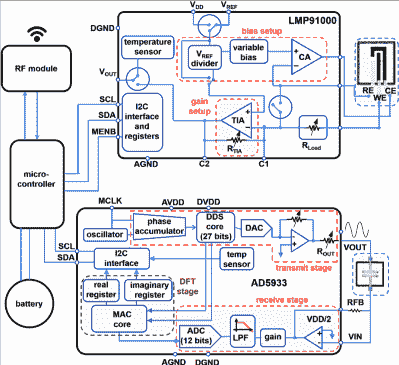

# 一种用于监测慢性伤口的智能绷带

> 原文：<https://hackaday.com/2020/05/12/a-smart-bandage-for-monitoring-chronic-wounds/>

在 Hackaday，我们总是被酷酷的生物黑客和传感器开发所吸引，它们使我们能够更好地研究和分析人体。我们经常浏览谷歌学术和 PubMed 来寻找最酷的项目，即使这意味着回到一两年前。普渡大学 [FlexiLab](https://engineering.purdue.edu/FlexiLab/) 的工程师们为我们带来了这个漂亮的[智能绷带，用于监测伤口愈合](https://www.researchgate.net/publication/326211270_Early_detection_and_monitoring_of_chronic_wounds_using_low-cost_omniphobic_paper-based_smart_bandages)。该设备使用一种全疏(疏水和疏油)纸基基底，与机载阻抗分析仪( [AD5933](https://www.analog.com/en/products/ad5933.html) )、用于测量尿酸和 pH 值的(与血糖仪中的[传感器类型相同)(](https://hackaday.com/2018/12/03/why-is-continuous-glucose-monitoring-so-hard/) [LMP91000](https://www.ti.com/product/LMP91000) )和用于无线传输数据的 2.4 GHz 天线( [nRF24L01](https://hackaday.com/?s=nrf24) )相耦合。所有这些都是用 Arduino Nano 编程的。他们甚至发布了他们的源代码。

为了检测尿酸，他们使用了尿酸酶，这种酶对尿酸非常特异，并且与其他化合物的交叉反应性很低。他们将尿酸滴在印刷在全疏纸上的银/氯化银电极上。同样，为了检测 pH 值，他们在两个单独的银/氯化银电极之间滴铸了一种称为聚苯胺翠绿亚胺盐(PANI-ES)的 pH 响应聚合物。剩下的就是将电极连接到 LMP91000 上，做一点编程，然后它们就有了自己的电化学传感器。阻抗分析仪的开发要简单一些，只需将未经修改的电极连接到 AD5933 上，并将电极放在伤口上。

作者指出，与其他学者发表的智能绷带相比，该设备使用了更简单的制造工艺，与卷到卷打印等大规模制造技术兼容。克服制造障碍是将你的想法送到消费者手中的关键一步。尽管他们还有很长的路要走，但 FlexiLab 似乎已经走上了正轨。我们会时常回来看看他们在做什么。

在此之前，看看 Hackaday 上的其他[电动绷带项目，甚至自己制作](https://hackaday.com/2008/07/02/electric-bandages/)[电化学传感器](https://hackaday.com/2018/08/04/cheap-psoc-enables-electrochemistry-research/)。