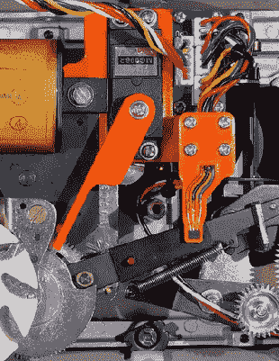

# 一个索拉里机械数字时钟黑客与一点额外的

> 原文：<https://hackaday.com/2022/02/14/a-solari-mechanical-digital-clock-hack-with-a-little-extra/>

[Alfredo Cortellini]在博洛尼亚的一家古董店闲逛时，偶然发现了一个 20 世纪 50 年代晚期钟表的好例子，它的形状是一个 Solari Cifra 5 slave clock，但正如店主警告的那样，它永远不会自己显示时间。这听起来像是一个挑战，由此产生的黑客是一个很好的，尊重内部调整，将其带入现代时代。由于时钟需要每分钟一次脉冲来跟踪时间，最简单的方法是打开后盖，通过拨动适当的杠杆手动设置正确的时间，然后让外部电路接管计时。[阿尔弗雷多]想要自主，并提出了一个解决方案，使这东西完全自动调整自己。

在电子方面，最初的原型制作是用 Nucleo 32 开发板和一堆模块进行的，然后转移到 Altium Designer 中设计的定制 PCB。一个 STM32G031 运行这个节目，几个按钮和一个 SSD1306 有机发光二极管显示器形成了用户界面。

使用一些策略性放置的磁铁和霍尔效应传感器，可以确定内部机制的状态。通过使用 DRV8871 电机驱动器 IC 驱动时钟的 24V 电磁体来实现微小的前进，其电源通过 TPS61041 升压转换器从 USB 电源产生。为了使机械装置与电子设备同步，该装置可以被驱动一次前进一分钟，但由于每小时需要 60 个脉冲，这可能需要一段时间，因为速度有限，无法可靠地做到这一点。解决方案是偷偷放入一个狡猾的 MG996R 高扭矩伺服电机，它推动小时推进杆，使单位更快地归零。零时位置的检测是通过监测日期推进机制来完成的，这种机制在这种时钟模型中没有使用。一旦调零，时钟就可以前进到正确的时间并保持最新。可以在[项目 GItHub](https://github.com/alcor6502/Solari-Cifra5-Firmware) 上找到利用免费 RTOS 的固件源，黑客日上有原理图和 Fusion360 文件。上面链接的 IO 项目。

如果你认为你以前在这里见过这些 Solari 软翻盖显示器，[你会非常正确](https://hackaday.com/2018/01/23/flip-clock-retrofit/)，但如果你对标记时间的流逝不感兴趣，而是将这种设备弯曲成你的其他指示奇思妙想，[我们也为你提供了](https://hackaday.com/2012/10/17/reverse-engineering-solari-soft-flap-displays/)。

 [https://www.youtube.com/embed/XzPwUXBhe4Q?version=3&rel=1&showsearch=0&showinfo=1&iv_load_policy=1&fs=1&hl=en-US&autohide=2&wmode=transparent](https://www.youtube.com/embed/XzPwUXBhe4Q?version=3&rel=1&showsearch=0&showinfo=1&iv_load_policy=1&fs=1&hl=en-US&autohide=2&wmode=transparent)

