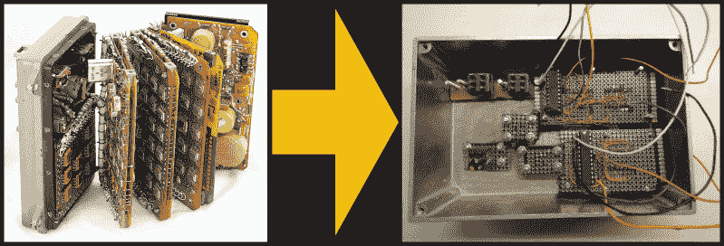

# 联盟号太空钟的复制品

> 原文：<https://hackaday.com/2021/03/08/a-soyuz-space-clock-replica/>

如果你喜欢旧苏联太空硬件的复古外观，那么这个由[David Whitty]设计的 774H 型联盟号数字时钟的[复制品可能是你办公桌的完美配件。放弃了最初的十块拥挤的电路板，[David]使用了一个 Arduino、一个 GPS 接收器和一些其他常见部件来创建一个令人信服的复制品。](http://g4fev.atspace.com/soyuz_clock.htm)

Out with the old, in with the new

他还做了一些功能上的改变，使它更适合作为我们这些地球人的普通时钟。如果你想自己承担这个项目，就要准备好一些真正的金属制品。在建设这个项目的过程中，没有 3D 打印细丝受到伤害。它基于一对经过大量修改的哈蒙德铸铝外壳，并添加了超过 1 公斤的铅压载物，以使其具有与原始外壳相当的重量。GPS 贴片天线巧妙地隐藏在后接口连接器上，但 USB 连接器的离散孔泄露了这不是原装的秘密。该软件(非商业用途免费)和构建说明可以在他的 [GitHub 库](https://github.com/G4FEV/-Soyuz-Capsule-Digital-Clock)上获得。

早在一月份，我们就报道过[Ken Shirriff]对一个真正的联盟号数字时钟内部的迷人探索。如果你喜欢旧的太空硬件，你绝对应该看看 653B 的[拆卸图](https://www.youtube.com/watch?v=N4K1QMTNw8A)，653 b 是 20 世纪 60 年代 774H 的机电前身。感谢[CuriousMarc]让我们关注这个项目。

 [https://www.youtube.com/embed/h-ZRZf_GYVY?version=3&rel=1&showsearch=0&showinfo=1&iv_load_policy=1&fs=1&hl=en-US&autohide=2&wmode=transparent](https://www.youtube.com/embed/h-ZRZf_GYVY?version=3&rel=1&showsearch=0&showinfo=1&iv_load_policy=1&fs=1&hl=en-US&autohide=2&wmode=transparent)

