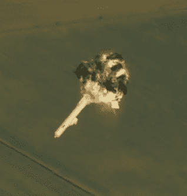

# SpaceX 猎鹰 9 号很快就会爆炸，这没关系

> 原文：<https://hackaday.com/2020/01/16/a-spacex-falcon-9-will-blow-up-very-soon-and-thats-ok/>

他们说不打破几个鸡蛋就做不成煎蛋卷，而且没有几个领域比火箭技术更能体现这种习语。这是一个不言而喻的结论:当你开发一种新的助推器时，至少会有一些试验品在这个过程中被销毁。事实上，一些人认为一个没有把硬件推到临界点的程序是一个测试不够积极的程序。

这就是为什么，假设一切按计划进行， [SpaceX 将在美国东部时间周六上午 8 点多一点摧毁他们的猎鹰 9 号助推器。这一事件将通过互联网进行现场直播，由于它在毁灭时将携带大约 70%的推进剂，这应该是一场精彩的表演。](https://www.nasa.gov/feature/spacex-nasa-gear-up-for-in-flight-abort-demonstration)

花费 6200 万美元似乎是一种奇怪的方式，但对于 SpaceX 来说，知道 Crew Dragon 发射中止系统(LES)将在实际飞行条件下工作是值得的。LES 已经成功测试过一次，但那是在地面上从静止状态开始的。它允许工程师们看到如果火箭仍在发射台上时发生中止，系统将如何运作，但正如联盟 MS-10 的损失戏剧性地证明了 T2，宇航员可能需要及时退出已经在前往太空途中的火箭。

在真正的紧急情况下，载人飞船很可能会加速逃离剧烈的爆炸和迅速膨胀的弹片云。在周六的测试中，将携带宇航员龙的猎鹰 9 号的完全毁灭将为宇宙飞船创造同样的生存条件，如果 LES 有任何希望将宇航员安全带回家园的话。因此，即使有某种方法可以防止助推器在测试中破裂，从工程的角度来看，摧毁它更有用。

当然，这只能解释为什么猎鹰 9 号会在测试中被摧毁。但是确切地说*这个功能正常的助推器如何在几秒钟内发现自己在大西洋上空被撕成碎片是一个同样有趣的问题。*

## 半模拟的灾难

F9R Dev1 activates its FTS

最初的设想是，地面控制人员将启动飞行终止系统(FTS)来摧毁火箭并启动 LES。在猎鹰 9 号上，终止系统使用炸药来“拉开”火箭的推进剂罐和机身，快速释放所有的 RP-1 和液态氧。这导致了半空中的爆燃，而不是彻底的爆炸。

从各方面考虑，这是压制猎鹰 9 号最快最安全的方法，旨在用于火箭偏离轨道并朝着人口密集区前进的情况。FTS 从未在运行中的猎鹰 9 号上使用过，但当“F9R Dev1”测试飞行器的机载计算机确定它正在远离预定的安全区域时，它会被使用。

但是为了测试的目的，如此有序的分解助推器并不适合许多潜在的中止情况。在实际任务中最有可能触发 LES 的事件是发动机故障、爆炸或其他。因此，为了周六的测试，地面控制将在飞行一分多钟后简单地命令主发动机关闭(MECO)。Crew Dragon 的系统会将这种推力损失解释为不可恢复的故障，并自动开始中止程序。

## 以 1.5 马赫的速度撞上砖墙

MECO 的时间框架也不是随意选择的。飞行大约一分钟后，飞行器将经历业内所称的“最大 Q 值”，此时气动结构载荷将达到最高。如果在机体承受最大应力的时期进行中止试验看起来是最困难的时候，那是因为确实如此。Max Q 不仅可以说是最有可能发生结构故障的点，而且在飞行的这一阶段使用 LES 将向 NASA 和 SpaceX 的工程师展示该系统在最坏情况下的表现。

接下来会发生什么谁也说不准。[一旦“载人龙”点燃其超级天龙发动机](https://hackaday.com/2019/07/15/new-space-abort-systems-go-back-to-the-future/)并脱离猎鹰 9 号助推器，火箭上面级的平顶将暴露在它从未设计过的超音速气流中。瞬间的巨大压力很可能会导致助推器坍塌。但是，即使助推器在涌入的空气中幸存下来，它在空气动力学上也会变得不稳定；它会很快偏离飞行方向并开始翻滚，这必然会将相对脆弱的机身撕成碎片。

无论是哪种情况，猎鹰 9 号的快速解体和由此导致的推进剂释放将为 LES 设计的那种戏剧性故障提供一个完美的模拟。

## 最后的倒计时

如果一切按计划进行，船员龙将弹出降落伞，溅落在卡纳维拉尔角以东约 32 公里的大西洋中。SpaceX 和 NASA 的回收团队都将利用这个机会排练从海洋中回收航天器的微妙任务。这个程序以前也练习过，但是从来没有在这么远的地方，或者在船员龙从这么高的高度返回的时候。

一次成功的飞行中止测试是通往人类对猎鹰 9 号和飞龙号进行评级的漫长道路上的最后一个里程碑。如果美国国家航空航天局(NASA)对他们本周末看到的情况感到满意，SpaceX 最早将于下个月把宇航员带到国际空间站，尽管最终完成认证过程可能会把首次运营飞行推迟到春天。

在波音的 Starliner 在 12 月的首次试飞中未能抵达国际空间站后，所有的目光现在都集中在 SpaceX 上。如果这次测试顺利进行，那么“载人龙”很可能成为自 2011 年航天飞机退役以来第一艘搭载宇航员的美国航天器。

 [https://www.youtube.com/embed/qObBRM4euxk?version=3&rel=1&showsearch=0&showinfo=1&iv_load_policy=1&fs=1&hl=en-US&autohide=2&wmode=transparent](https://www.youtube.com/embed/qObBRM4euxk?version=3&rel=1&showsearch=0&showinfo=1&iv_load_policy=1&fs=1&hl=en-US&autohide=2&wmode=transparent)

