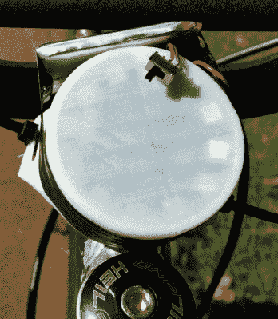

# 自行车导航的时尚解决方案

> 原文：<https://hackaday.com/2019/05/29/a-stylish-solution-for-bike-navigation/>

[André Biagioni]正在开发一款名为 Aurora 的开放式硬件自行车导航设备，它非常漂亮，足以让你骑着自行车去上班。这种光滑的框架安装设备通过 SK6812 RGB LEDs 的圆形阵列向用户传递信息，让您只需快速扫视一下就可以找到您需要知道的信息。没有屏幕可以看，也没有按钮可以按。

 硬件已经经历了几次修改，这正是我们期待看到的 2019 年 Hackaday 奖的参赛作品。[André]用拉链绑在自行车前部的概念证明可能有用，但它并不完全是工业设计的缩影。这足以让他看到这个想法的价值，并从那里他一直致力于小型化的设计。

那么它是如何工作的呢？nRF52832 供电的 Aurora 通过蓝牙连接到您的手机，并通过圆形 LED 阵列向您传递逐路段导航信息。这可以防止你不得不摸索你的手机，安德烈希望这将提高安全性。当你没有前往任何特定的地方时，极光也可以作为未来的磁罗盘。

André在 Hackaday.io 上发布这个项目时，Aurora 硬件似乎已经完成了至少三个版本，我们非常有兴趣看看它将何去何从。今年 Hackaday 奖的主题是超越一次性的原型阶段，设计出适合生产的东西，到目前为止，我们可以说 Aurora 项目肯定会迎接挑战。

 [https://www.youtube.com/embed/tw7FlcgAavs?version=3&rel=1&showsearch=0&showinfo=1&iv_load_policy=1&fs=1&hl=en-US&autohide=2&wmode=transparent](https://www.youtube.com/embed/tw7FlcgAavs?version=3&rel=1&showsearch=0&showinfo=1&iv_load_policy=1&fs=1&hl=en-US&autohide=2&wmode=transparent)

The [HackadayPrize2019](https://prize.supplyframe.com) is Sponsored by:     