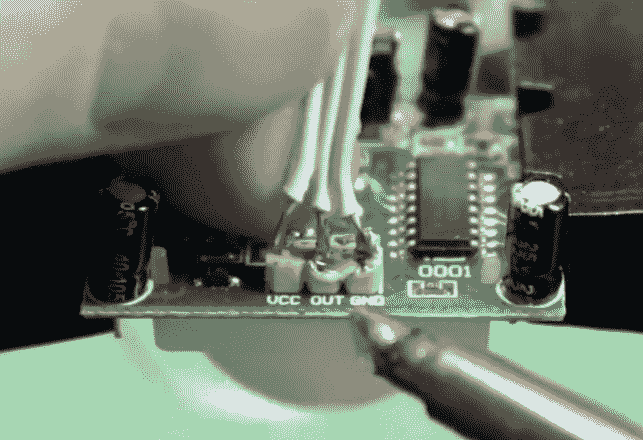

# 一个超级简单的 ESP8266 IOT 运动传感器

> 原文：<https://hackaday.com/2018/07/19/a-super-simple-esp8266-iot-motion-sensor/>

很难夸大像 Wemos D1 Mini 这样的 ESP8266 开发板有多棒。只需几美元，你就可以得到一个相当强大的支持 Wi-Fi 的微控制器，它有足够的免费数字引脚来做一些有用的工作。像之前的 Arduino 和 Raspberry Pi 一样，ESP8266 是一款开辟了全新黑客和开发领域的设备，这些领域不像以前那样实用或经济高效。

 作为一个完美的例子，看看【埃里克·威廉】发明的这个极其简单的[联网运动探测器。只需一个 Wemos D1 迷你，一个标准的 PIR 传感器和一些开源代码，你就可以创建一个实用的独立运动传感器模块，可以放在任何你想监视的地方。当传感器检测到移动的物体时，它将触发 IFTTT 事件。](https://github.com/MKme/Wemos-D1-ESP8266-PIR-Alarm)

只需要三根电线就可以把电子设备连接起来，但是[Eric]仍然提供了一个线路图，这样年轻的玩家就不会感到困惑。加上 Thingiverse 的 [3D 打印外壳，这个项目的硬件部分就完成了。](https://www.thingiverse.com/thing:2489968)

使用[Eric]写的 Arduino 草图，你可以很容易地插入你的 Wi-Fi 信息和 IFTTT 键和触发器。剩下要做的就是将这个物联网运动传感器安装在要监控的区域，让它发挥作用。一旦 PIR 传感器看到有东西在动，ESP8266 就会触发 IFTTT 之后会发生什么取决于你和你的想象力。在休息后的视频中，您可以看到一个示例用法，它会在您的移动设备上弹出一个通知，让您知道有事情正在进行。

凭借其低成本和连接选项，ESP8266 确实是遥感应用的完美平台。尽管值得称赞，但这仍然不是我们见过的最简单的[运动传感器。](https://hackaday.com/2016/05/23/arduino-motion-detection-with-a-bit-of-wire/)

 [https://www.youtube.com/embed/y9XC5yHR5Bk?version=3&rel=1&showsearch=0&showinfo=1&iv_load_policy=1&fs=1&hl=en-US&autohide=2&wmode=transparent](https://www.youtube.com/embed/y9XC5yHR5Bk?version=3&rel=1&showsearch=0&showinfo=1&iv_load_policy=1&fs=1&hl=en-US&autohide=2&wmode=transparent)

