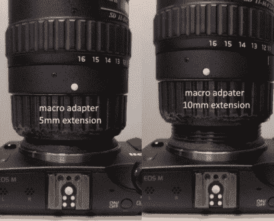

# 一个非常小的 3D 打印宏观延伸管

> 原文：<https://hackaday.com/2019/09/04/a-teeny-tiny-3d-printed-macro-extension-tube/>

当你听到“伸缩管”这个词时，你可能会想到一些相当长的东西，对吗？但当[Loudifier]需要一个伸缩管来用佳能 EF-M 相机的广角镜头拍摄极端特写时，它需要很小……非常小。最终的 3D 打印延伸部分[提供了 0 到 10 毫米](https://www.prusaprinters.org/prints/5210-efef-s-to-ef-m-macro-adapter)之间的可调长度。

 但这不是*只是*的一个延伸管，那就太容易了。根据[Loudifier]的说法，理想的延伸距离应该在 3 毫米左右，但不幸的是，EF-M 镜头的安装卡口稍微超过 5 毫米。为了解决这个问题，延伸管还适应 EF/EF-S 镜头，这种镜头具有更短的安装长度，允许它比其他情况下物理上可能的距离更近。

[Loudifier]表示，在相机和镜头之间增加电气连接(用于自动对焦等功能)将是理想的，但实现这一点的逻辑有点令人生畏。目前，地平线上最合理的升级是在外部添加一些彩色点，以帮助对齐相机，适配器和镜头。随着 STLs 和 Fusion 设计文件在 Creative Commons 下发布，也许社区甚至会接受使其适应其他镜头类型的挑战。

对于这个项目的对立面，[看看几周前我们报道过的 300 毫米长的 3D 打印延伸管](https://hackaday.com/2019/08/09/3d-printed-extension-for-extreme-macro-photography-includes-lens-electronic-control/)，它启发了【Loudifier】将这个项目发送给我们。