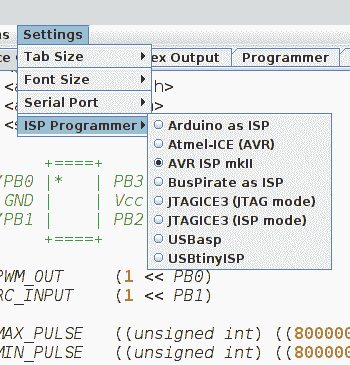

# 给你衣服的一个小 IDE

> 原文：<https://hackaday.com/2019/02/08/a-tiny-ide-for-your-attiny/>

在为 ATtiny 系列微控制器(如 ATtiny85 或 ATtiny10)编写代码时，人们通常使用两种方法之一:要么在 Arduino IDE 中添加对芯片的支持，要么打开他们选择的文本编辑器，手动完成所有工作。此外，当然还有一些人在使用 Eclipse。但是[韦恩·霍尔德]认为有更好的方法。

 该项目最初是【Wayne】在 Mac OS 下用 C 语言编写 ATtiny10 的简单方法，但后来已经发展成为一个开源的、跨平台的[集成开发环境(IDE)，用于用 C、C++或汇编语言编写各种 ATtiny 芯片](https://github.com/wholder/ATTiny10IDE)。它不仅集成了源代码编辑器和程序员，而且它甚至捆绑了包括框图和引脚排列在内的常见芯片变体的文档；让它成为 ATtiny hacking 真正的一站式服务。

他的 IDE 运行在 Java 下，包括 OpenJDK，【Wayne】为那些不想克隆整个 GitHub 库的人提供了一个稳定的预建可执行文件。他在文章中加入了 GNU/AVR 工具链，尽管他指出目前为止测试仅限于 Mac OS，并且他对来自 Windows 和 Linux 用户的反馈很感兴趣。汇编要么用 GNU AVR-AS 完成，要么用他自己设计的汇编程序完成，尽管后者目前仅限于 ATTiny10。

为了将代码放到芯片上，IDE 支持使用 Arduino 作为程序员，也支持使用专用硬件，如 BusPirate 或 USBasp。如果你走 Arduino 路线，[Wayne]甚至想出了一个小小的转接板，他通过 OSH Park 提供了这个转接板，以帮助解决小芯片的问题。

ATtiny10 可能有一个学习曲线，但作为交换，这个家族的[微型微控制器提供了令人难以置信的能力](https://hackaday.com/2016/07/02/hackaday-prize-entry-a-minimal-attiny-voltage-and-frequency-counter/)。当你和一粒本质上可编程的米粒一起工作时，[唯一的限制是你自己的创造力](https://hackaday.com/2016/12/10/7-leds-2-pins-beat-that-charlieplexing/)。